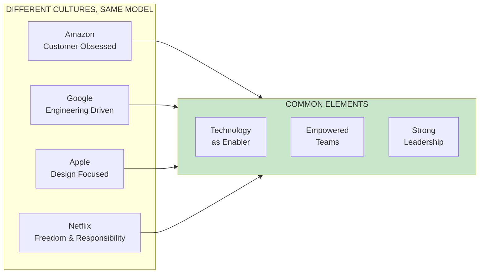
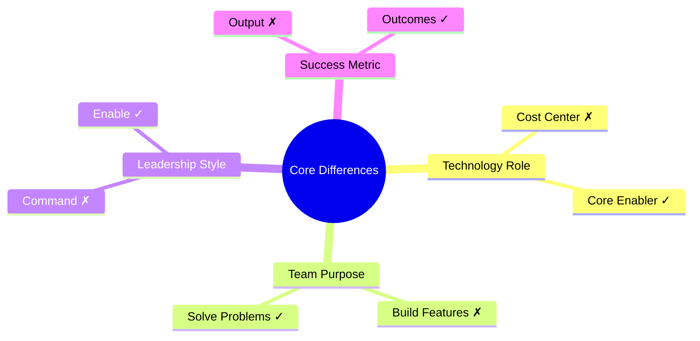

import { Aside } from '@astrojs/starlight/components';

# Chapter 1: Behind Every Great Company

<Aside type="tip" title="Simply Explained">
**In one sentence:** The best companies let their teams figure out HOW to solve problems, instead of just telling them what to build.

**Imagine this:** Think of two soccer teams. One coach tells players exactly where to run and when to kick. The other coach says "We need to score—work together to figure out how." Which team plays better?

The best companies like Apple and Google all do something similar: they trust their teams to be creative problem-solvers, not just instruction-followers. That's the real secret.

**Remember:** Great products come from teams that are trusted to think, not just do.
</Aside>

## Chapter Overview

The differences between how the best companies create technology-powered products and how most companies work are both fundamental and striking. While culture matters, the key differences are more fundamental—they're about views on technology's role, the purpose of technology people, and how teams solve problems together.

## Key Insight: Beyond Culture

Amazon, Google, Apple, and Netflix are all strong product companies with very different cultures. What they have in common is more fundamental than culture—it's about:

1. **Views on technology's role** in the business
2. **Purpose of technology people** (solve problems, not serve stakeholders)
3. **How teams work together** to create solutions

## Bill Campbell's Influence

A surprising common thread among many of the best product companies is Bill Campbell, who coached the founders of Apple, Amazon, and Google:

> "Leadership is about recognizing that there's a greatness in everyone, and your job is to create an environment where that greatness can emerge."

This quote captures the essence of empowered product teams—it's not about having the best people, but about creating the right environment for ordinary people to do extraordinary things.

## The Core Message

The most important insight from this chapter is that the differences between the best and the rest run much deeper than techniques or methodologies. It's about a fundamentally different view of:

## Reflection Questions

- [ ] How does your organization view technology—as a cost center or a core enabler?
- [ ] Are your teams given problems to solve or features to build?
- [ ] Do your leaders create environments for greatness or command and control?

## Related Chapters

- [Chapter 2: The Role of Technology](/chapters/part-01-lessons/ch02-role-of-technology/)
- [Chapter 3: Strong Product Leadership](/chapters/part-01-lessons/ch03-strong-leadership/)
- [Chapter 4: Empowered Product Teams](/chapters/part-01-lessons/ch04-empowered-teams/)
