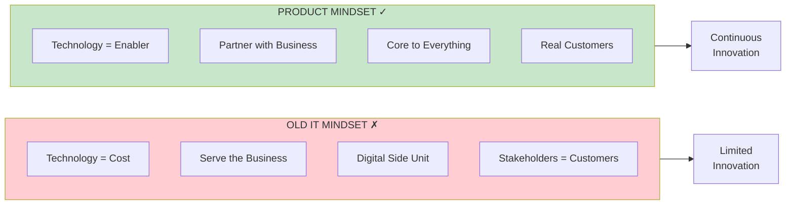
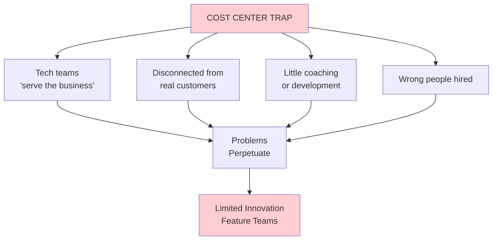
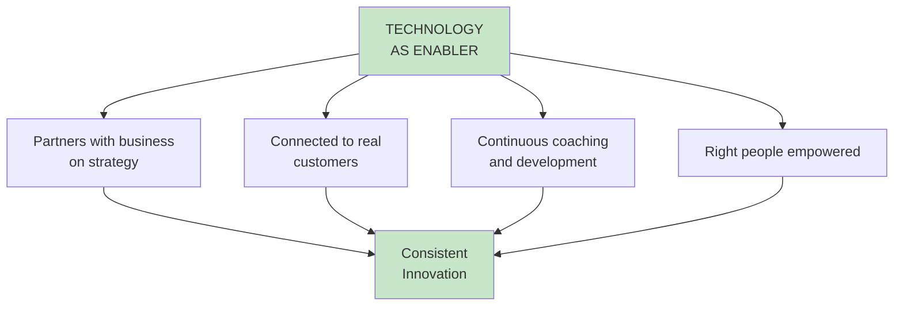

import { Aside } from '@astrojs/starlight/components';

# Chapter 2: The Role of Technology

<Aside type="tip" title="Simply Explained">
**In one sentence:** Technology should be your team's superpower, not just a bill you have to pay.

**Imagine this:** You have a robot that can help with homework. You could see it as an annoying thing that costs electricity, or as an amazing helper that makes you smarter. Same robot—totally different results based on how you think about it.

Some companies treat technology like a cost—something to minimize. The best companies treat it like a superpower—something to invest in because it helps them win.

**Remember:** Technology isn't an expense. It's an enabler. Treat it like your secret weapon.
</Aside>

## The IT Mindset Problem

So many companies still have the old IT mindset when it comes to technology. Technology is viewed as a **necessary cost** rather than the **core business enabler** it needs to be.

## Key Symptoms of IT Mindset

| Symptom | IT Mindset | Product Mindset |
|---------|-----------|-----------------|
| **Technology's role** | Cost center | Core business enabler |
| **Tech people's job** | "Serve the business" | Solve real problems |
| **Customer focus** | Stakeholders as customers | Real end customers |
| **Organization** | Separate "digital" unit | Integrated with business |
| **Decision making** | Business decides, tech implements | Collaborative discovery |

## The Cost Center Trap

## Technology as Core Enabler

In strong product companies, technology isn't a support function—it's the heart of how the company creates value:

## Reflection Questions

- [ ] Is technology viewed as a cost to be minimized or an investment to be leveraged?
- [ ] Are technology teams connected to real customers or just stakeholders?
- [ ] Do technology leaders have a seat at the strategy table?

## Related Chapters

- [Chapter 1: Behind Every Great Company](/chapters/part-01-lessons/ch01-behind-great-company/)
- [Chapter 3: Strong Product Leadership](/chapters/part-01-lessons/ch03-strong-leadership/)
