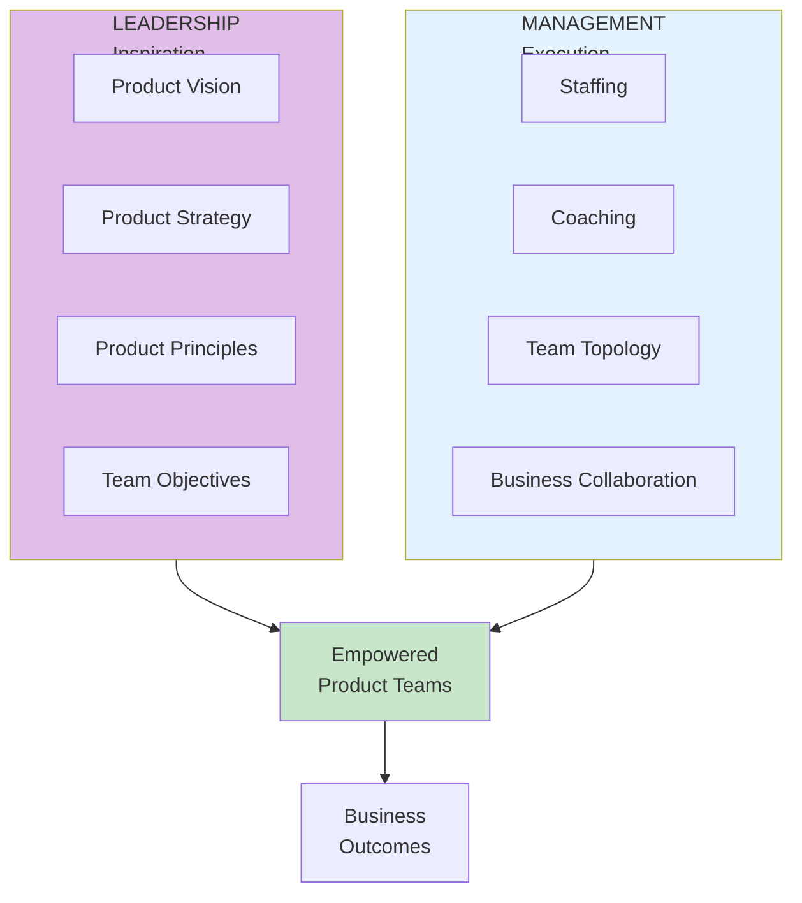
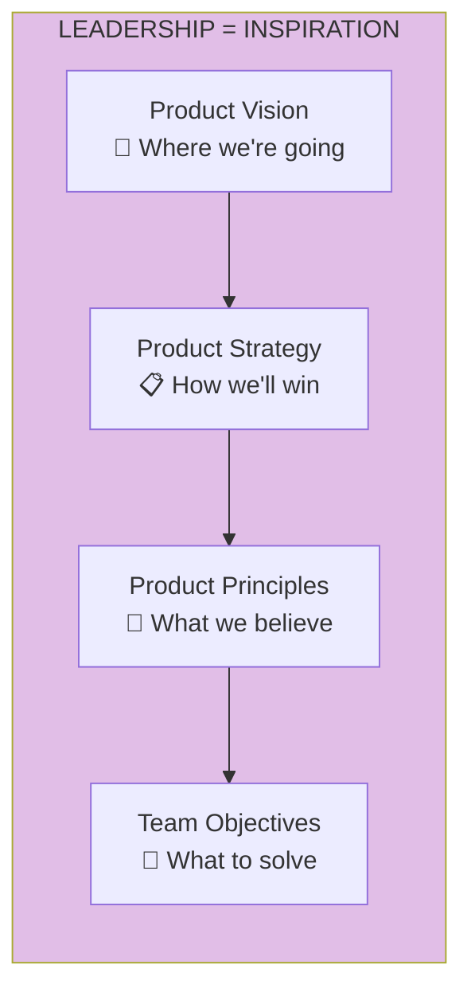
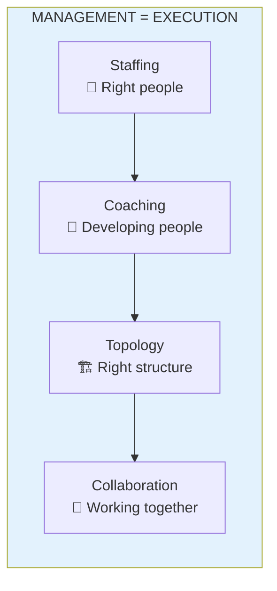
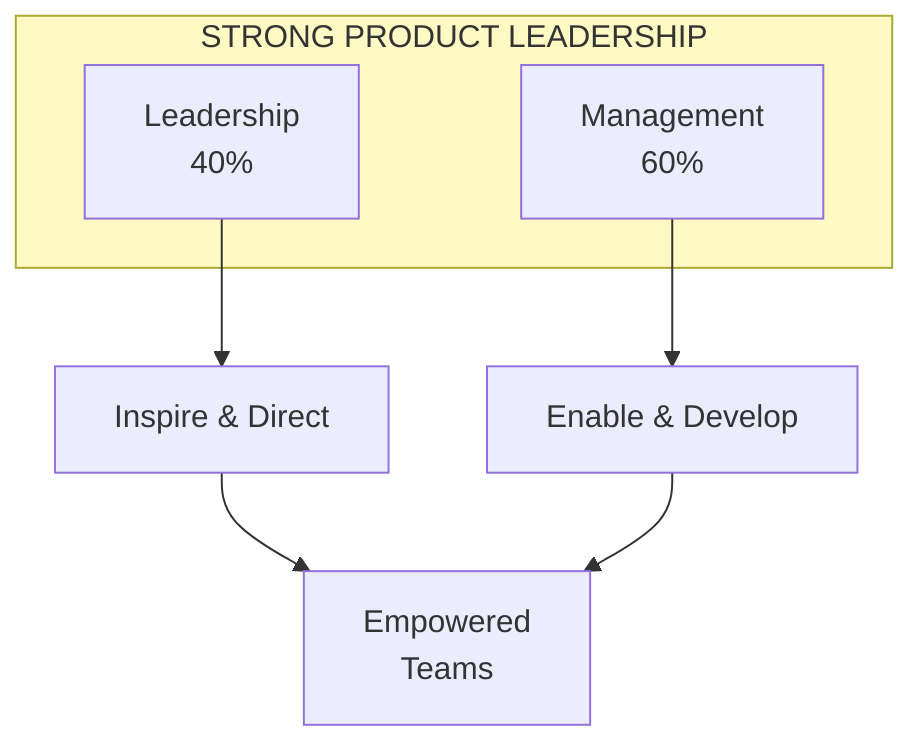

import { Aside } from '@astrojs/starlight/components';

# Chapter 3: Strong Product Leadership

<Aside type="tip" title="Simply Explained">
**In one sentence:** Good leaders do two jobs—they inspire people with a big goal AND help them get better at their work.

**Imagine this:** A soccer coach needs to do two things. First, get everyone excited about winning the championship (that's leadership). Second, run practice drills and help each player improve (that's management). You need BOTH to win.

Bad bosses only do one: they either give big speeches but don't help anyone improve, or they manage tasks but never inspire anyone. Great leaders do both.

**Remember:** Leaders inspire with vision. Managers help with execution. The best do both.
</Aside>

## Leadership vs Management

Strong product leadership requires both **leadership** (inspiration) and **management** (execution). These are complementary but distinct responsibilities.

## The Role of Leadership: Inspiration

Leaders set the direction and inspire teams by providing:

## The Role of Management: Execution

Managers enable execution by developing people and removing obstacles:

## The Leadership-Management Balance

## Common Anti-Patterns

| Anti-Pattern | Problem | Solution |
|--------------|---------|----------|
| All leadership, no management | Vision without execution | Balance with coaching & staffing |
| All management, no leadership | Execution without direction | Invest in vision & strategy |
| Command & control | Teams not empowered | Trust and enable teams |
| Hands-off | No coaching or support | Active coaching mindset |

## Reflection Questions

- [ ] Do your leaders provide both inspiration AND execution support?
- [ ] Is there a clear product vision that teams can rally around?
- [ ] Are managers actively coaching and developing their people?

## Related Chapters

- [Chapter 7: The Coaching Mindset](/chapters/part-02-coaching/ch07-coaching-mindset/)
- [Chapter 37: Creating a Compelling Vision](/chapters/part-04-vision/ch37-compelling-vision/)
