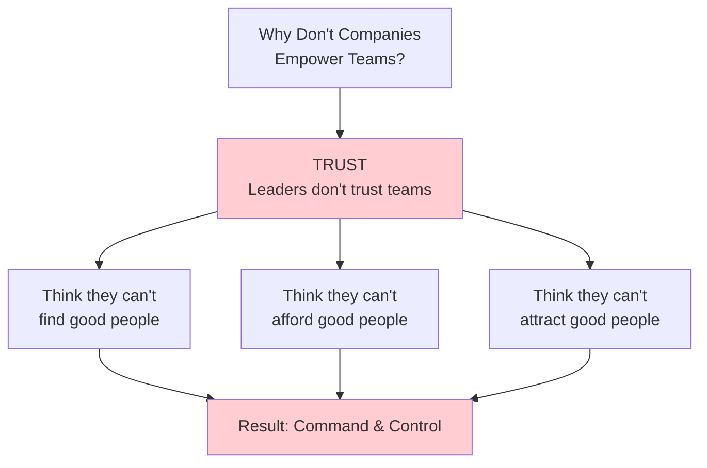
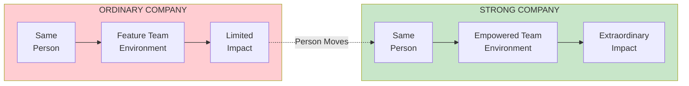
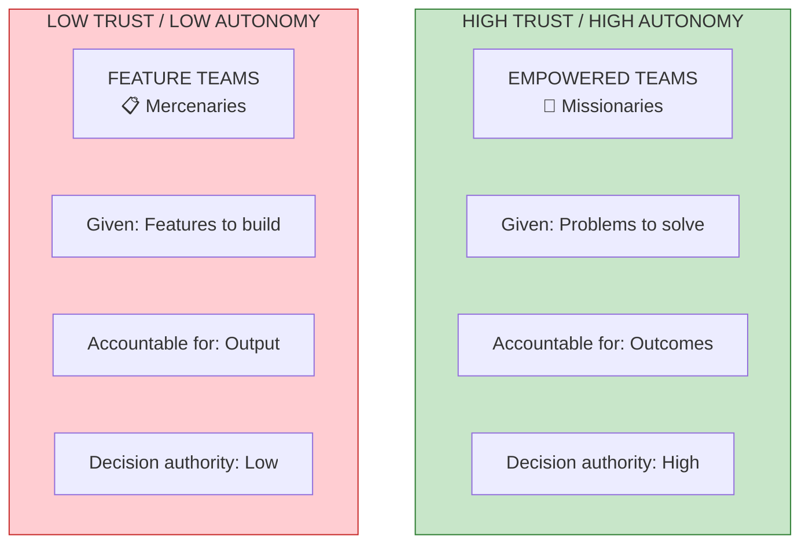
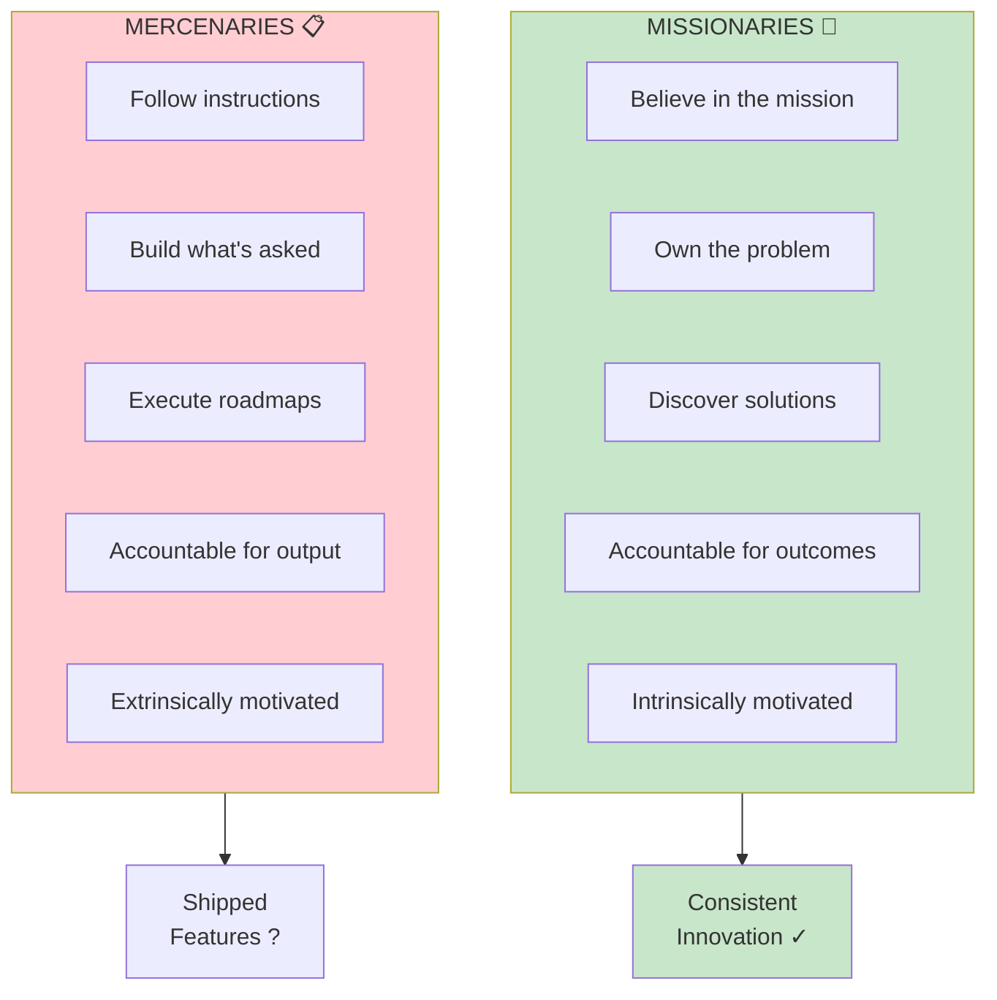
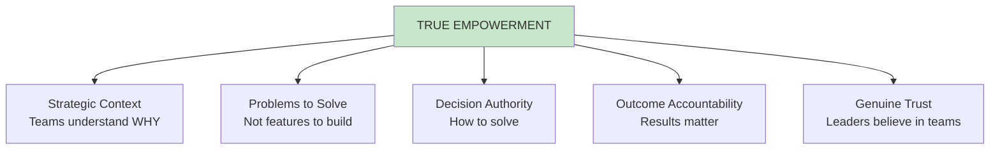

import { Aside } from '@astrojs/starlight/components';

# Chapter 4: Empowered Product Teams

<Aside type="tip" title="Simply Explained">
**In one sentence:** Empowered teams figure out HOW to solve problems; feature teams just follow instructions.

**Imagine this:** Two groups building treehouses. Group A is told "Build a place for us to hang out—make it awesome!" They brainstorm, get creative, and build something they're proud of. Group B gets exact blueprints: "Put this board here, this nail there." They just follow orders.

Which group cares more about the result? Which treehouse is better?

The book calls Group A "missionaries" (they believe in the mission) and Group B "mercenaries" (they just do what they're paid to do).

**Remember:** Give people problems to solve, not instructions to follow.
</Aside>

## Chapter Overview

This chapter addresses the central question: **Why don't more companies empower their teams?** The answer typically comes down to one word: **trust**. Leaders don't believe they have the right people to truly empower. But maybe the important difference lies elsewhere.

## The Real Difference

People who move from ordinary companies to strong product companies dramatically improve their performance. The people aren't different—**the environment is different**.

## Empowered vs Feature Teams: The 2x2 Matrix

## Detailed Comparison

| Aspect | Empowered Teams | Feature Teams |
|--------|-----------------|---------------|
| **Assignment** | Problems to solve | Features to build |
| **Accountability** | Business outcomes | Delivery of output |
| **Discovery** | Team discovers solutions | Solutions pre-determined |
| **Trust Level** | High | Low |
| **Autonomy** | High | Limited |
| **Innovation** | Expected and continuous | Rare and risky |
| **Motivation** | Intrinsic (missionaries) | Extrinsic (mercenaries) |

## The Missionaries vs Mercenaries Metaphor

## What Empowerment Actually Means

True empowerment isn't just about giving teams more freedom. It requires:

## Key Quote

> "Maybe these strong companies have different views on how to leverage their talent in order to help their ordinary people reach their true potential and create, together, extraordinary products."

## Reflection Questions

- [ ] Does your organization treat technology teams as feature factories or problem solvers?
- [ ] Do your teams understand the business outcomes they're accountable for?
- [ ] Are teams given genuine decision authority about how to solve problems?
- [ ] Do leaders truly trust their teams, or just pay lip service to empowerment?

## Related Chapters

- [Chapter 1: Behind Every Great Company](/chapters/part-01-lessons/ch01-behind-great-company/)
- [Chapter 7: The Coaching Mindset](/chapters/part-02-coaching/ch07-coaching-mindset/)
- [Chapter 53: Empowerment](/chapters/part-07-objectives/ch53-empowerment/)

## Related Concepts

- [Empowered Teams](/concepts/empowered-teams/)
- [The Product Model](/concepts/product-model/)
