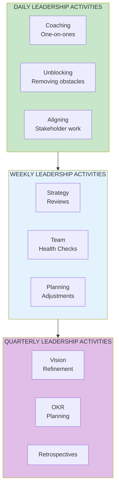

import { Aside } from '@astrojs/starlight/components';

# Chapter 5: Leadership in Action

<Aside type="tip" title="Simply Explained">
**In one sentence:** Great leaders spend most of their time helping people grow, not telling them what to do.

**Imagine this:** Two coaches. Coach A spends practice yelling "Do this! Do that!" Coach B spends practice asking "What do you think went wrong? How could you do it better?" Both teams practice the same hours—but Coach B's players improve faster.

The best leaders spend 40% of their time coaching (helping people learn) and only 10% directing work. Regular managers flip those numbers.

**Remember:** If you're always telling people what to do, you're not helping them grow.
</Aside>

## What Leaders Actually Do

This chapter bridges the conceptual (what strong leadership looks like) with the practical (how leaders spend their time).

## The Leader's Calendar

Strong product leaders spend their time very differently from managers in feature-team organizations:

| Time Allocation | Feature Team Manager | Empowered Team Leader |
|-----------------|---------------------|----------------------|
| **Directing work** | 50% | 10% |
| **Coaching** | 10% | 40% |
| **Strategy/Vision** | 10% | 25% |
| **Stakeholder collaboration** | 20% | 15% |
| **Administrative** | 10% | 10% |

## Reflection Questions

- [ ] How do your leaders spend their time compared to this model?
- [ ] Is coaching the primary activity or an afterthought?
- [ ] Are leaders investing in vision and strategy?

## Related Chapters

- [Chapter 3: Strong Product Leadership](/chapters/part-01-lessons/ch03-strong-leadership/)
- [Chapter 7: The Coaching Mindset](/chapters/part-02-coaching/ch07-coaching-mindset/)
