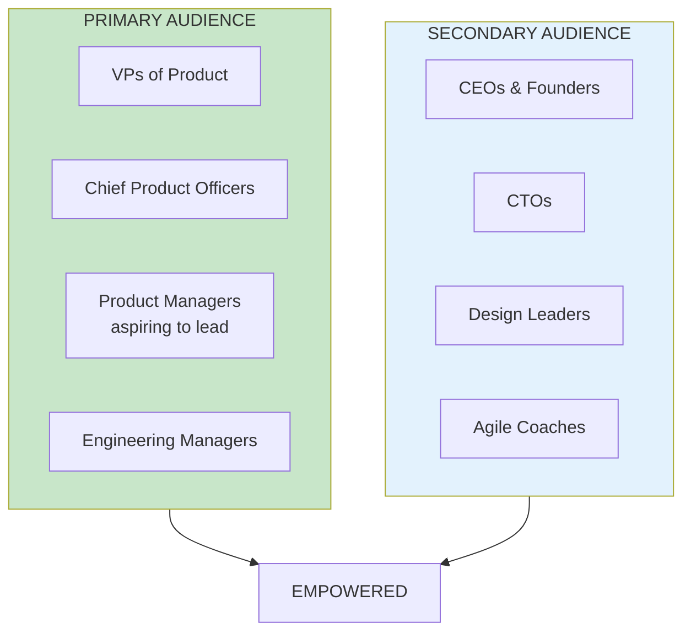
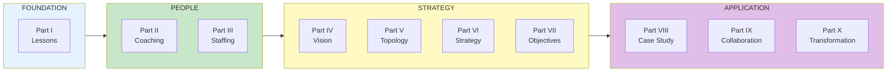

import { Aside } from '@astrojs/starlight/components';

# Chapter 6: A Guide to EMPOWERED

<Aside type="tip" title="Simply Explained">
**In one sentence:** This book teaches leaders how to help ordinary people do extraordinary things.

**Imagine this:** A cookbook doesn't just list recipes—it tells you which ones to start with if you're a beginner, and which ones are for when you want to impress someone. This chapter is like that: it helps you figure out where to start based on what you need.

New to leading teams? Start with Parts I-III. Want to fix how your teams work? Try Parts IV-VII. Trying to change your whole organization? Parts VIII-X are for you.

**Remember:** You don't have to read every chapter. Pick what helps you most right now.
</Aside>

## Who This Book Is For

EMPOWERED is primarily written for product leaders—people responsible for product teams. But the principles apply broadly:

## Book Structure Overview

## How to Use This Book

| Reading Style | Parts to Focus On | Best For |
|---------------|-------------------|----------|
| **New to product leadership** | I, II, III | Building foundation |
| **Improving team effectiveness** | IV, V, VI, VII | Tactical improvements |
| **Leading transformation** | VIII, IX, X | Organizational change |
| **Reference/specific topics** | Any part | Deep dives |

## Related Chapters

- [Part I Overview](/chapters/part-01-lessons/overview/)
- [Part II Overview](/chapters/part-02-coaching/overview/)
