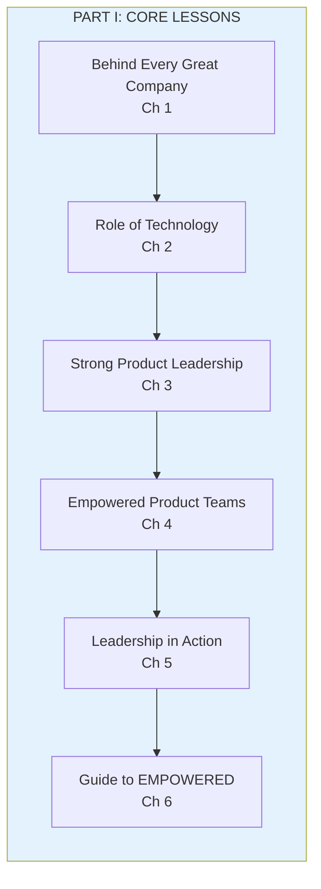
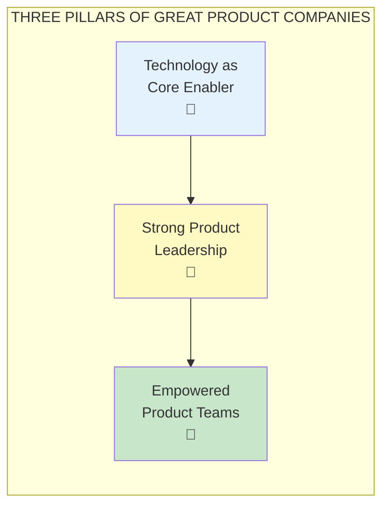
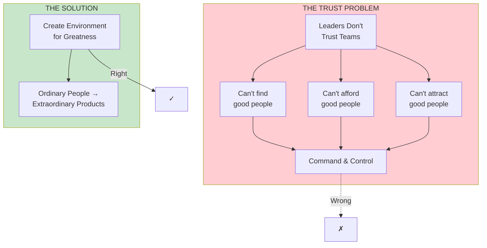

import { Aside } from '@astrojs/starlight/components';

# Part I: Lessons from Top Tech Companies

**Chapters 1-6** | The foundation of everything else in EMPOWERED

<Aside type="tip" title="Simply Explained">
**In one sentence:** The best companies trust their teams to solve problems, instead of just telling them what to build.

**Imagine this:** Two classrooms. In one, the teacher gives exact instructions for everything. In the other, the teacher says "Here's a problem—work together to figure it out." Which class learns more and has more fun?

The best tech companies—Apple, Google, Amazon—all figured out the same secret: give smart people interesting problems and trust them. The rest just hand out to-do lists.

**Remember:** It's not about finding magical people. It's about creating an environment where ordinary people can do extraordinary things.
</Aside>

## Part Overview

Part I establishes the fundamental differences between how the best product companies work and how most companies work. These differences go beyond "product culture"—they're about the role of technology, the purpose of people, and how teams solve problems.

## Key Insights

### The Three Pillars

Strong product companies share three fundamental characteristics that enable consistent innovation:

### The Trust Problem

Most companies don't empower their teams because **leaders don't trust the teams**. They believe they can't find, afford, or attract the level of people needed. But the real difference lies in how companies leverage talent to help ordinary people create extraordinary products.

## Bill Campbell's Wisdom

The legendary coach Bill Campbell provided executive coaching to the founders of Apple, Amazon, and Google. His philosophy underpins much of EMPOWERED:

> "Leadership is about recognizing that there's a greatness in everyone, and your job is to create an environment where that greatness can emerge."

## Chapters in This Part

| Chapter | Title | Key Concept |
|---------|-------|-------------|
| [Chapter 1](/chapters/part-01-lessons/ch01-behind-great-company/) | Behind Every Great Company | What separates the best |
| [Chapter 2](/chapters/part-01-lessons/ch02-role-of-technology/) | The Role of Technology | Core enabler vs cost center |
| [Chapter 3](/chapters/part-01-lessons/ch03-strong-leadership/) | Strong Product Leadership | Leadership vs management |
| [Chapter 4](/chapters/part-01-lessons/ch04-empowered-teams/) | Empowered Product Teams | Missionaries vs mercenaries |
| [Chapter 5](/chapters/part-01-lessons/ch05-leadership-action/) | Leadership in Action | Putting it into practice |
| [Chapter 6](/chapters/part-01-lessons/ch06-guide-empowered/) | A Guide to EMPOWERED | How to use this book |

## Related Concepts

- [Empowered Teams](/concepts/empowered-teams/)
- [Leadership](/concepts/leadership/)
- [The Product Model](/concepts/product-model/)
