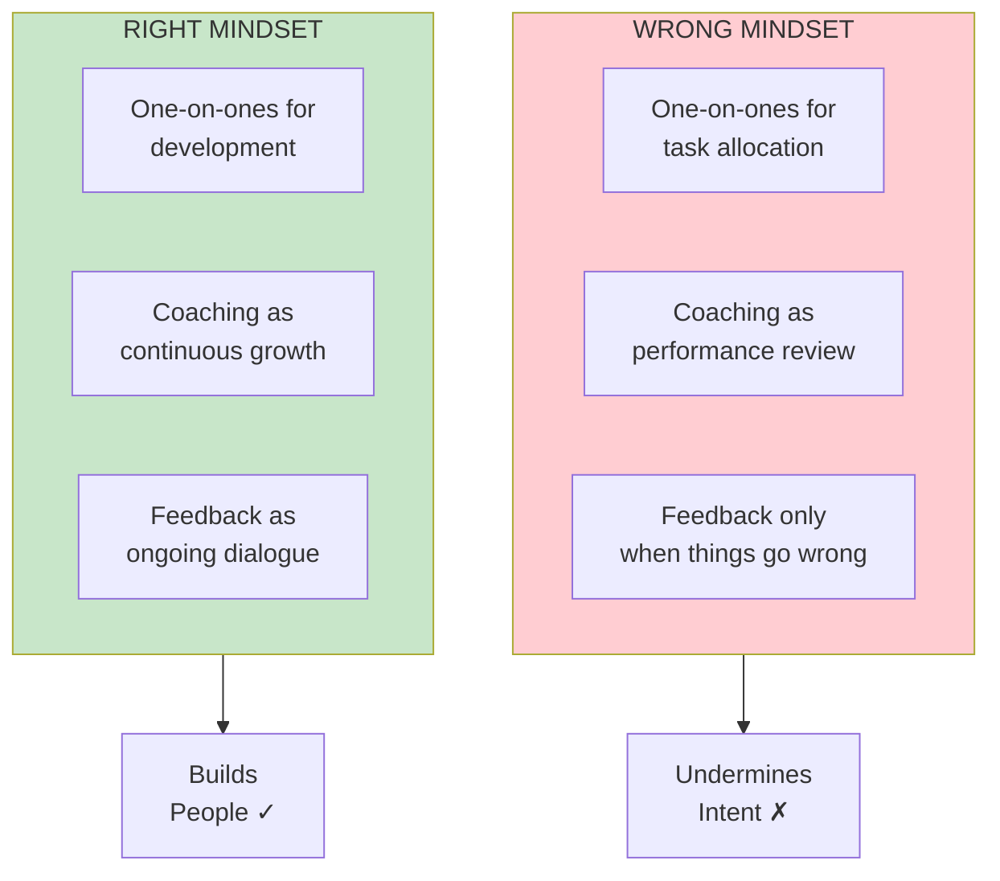
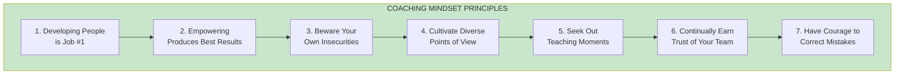

import { Aside } from '@astrojs/starlight/components';

# Chapter 7: The Coaching Mindset

<Aside type="tip" title="Simply Explained">
**In one sentence:** Before you can coach well, you have to believe that your job is to help people grow—not just get work done.

**Imagine this:** A piano teacher could either: (A) just make sure you play the right notes, or (B) help you understand WHY certain techniques work so you can become a great pianist. Same lesson time—totally different results.

If you think meetings with your team are just for checking tasks, you'll miss the chance to help them grow. But if you see every conversation as a chance to teach, everything changes.

**Remember:** Techniques matter, but mindset matters more. Believe developing people is your #1 job.
</Aside>

## The Foundation

The coaching mindset is the foundation that directs how you apply coaching techniques. Without the right mindset, even good techniques can be harmful.

## Seven Principles of the Coaching Mindset

## Principle Deep Dives

### 1. Developing People is Job #1

Your primary responsibility as a leader is developing your people. Everything else flows from this.

### 2. Empowering People Produces Best Results

When you genuinely empower people—giving them problems to solve and the authority to solve them—you get better results than any amount of direction could produce.

### 3. Beware Your Own Insecurities

Your insecurities can undermine your coaching. Watch for times when you might be:
- Taking credit for team successes
- Avoiding hard conversations
- Micromanaging to feel in control

### 4. Cultivate Diverse Points of View

Seek out people who think differently. Diverse perspectives lead to better solutions.

### 5. Seek Out Teaching Moments

Every situation is an opportunity to help someone grow. Look for these moments actively.

### 6. Continually Earn the Trust of Your Team

Trust isn't earned once—it's earned continuously through consistent actions and genuine care.

### 7. Have the Courage to Correct Mistakes

When mistakes happen, address them directly. The courage to have hard conversations is essential.

## Anti-Patterns to Avoid

| Anti-Pattern | Why It's Harmful | Better Approach |
|--------------|------------------|-----------------|
| One-on-ones for task tracking | Missed development opportunity | Focus on growth |
| Avoiding difficult feedback | Problems fester | Address early with care |
| Taking credit for successes | Demotivates team | Celebrate their wins |
| Solving problems for people | Doesn't build capability | Guide them to solve |

## Reflection Questions

- [ ] Do you view developing people as your primary job?
- [ ] Are there insecurities affecting your coaching?
- [ ] When did you last seek out a different perspective?
- [ ] What teaching moments have you created recently?

## Related Chapters

- [Chapter 8: The Assessment](/chapters/part-02-coaching/ch08-assessment/)
- [Chapter 10: The One-on-One](/chapters/part-02-coaching/ch10-one-on-one/)
