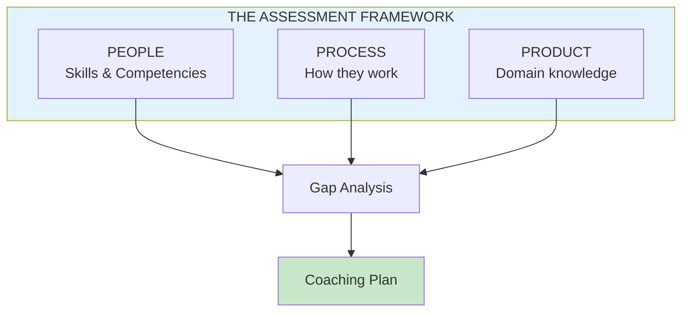
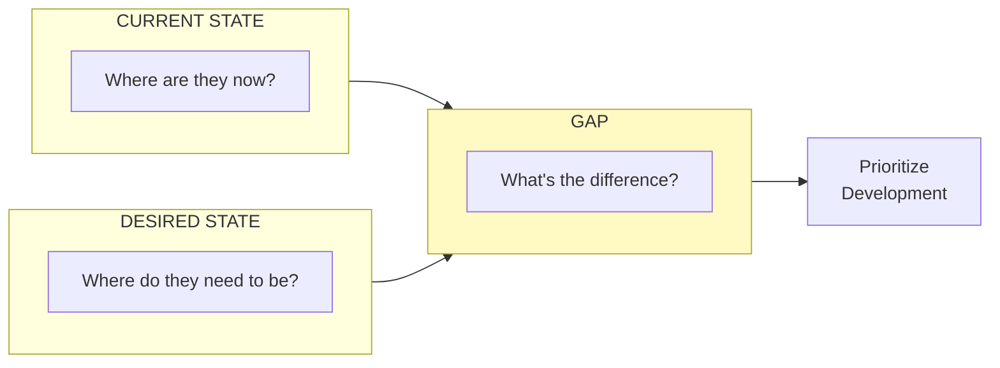

import { Aside } from '@astrojs/starlight/components';

# Chapter 8: The Assessment

<Aside type="tip" title="Simply Explained">
**In one sentence:** Before you can help someone improve, you need to understand where they are now and where they need to go.

**Imagine this:** A doctor can't prescribe medicine without first checking what's wrong. Same with coaching! You need to figure out: What are they good at? What do they struggle with? What do they need to learn?

Look at three things: Do they understand the product? Do they know how to get work done? Do they work well with others? Find the gaps, then you know what to work on.

**Remember:** You can't help someone grow if you don't know where they're starting from.
</Aside>

## People, Process, and Product

Effective coaching starts with assessing where someone is today. The assessment framework covers three dimensions:

## The Gap Analysis

For each dimension, assess current state vs. desired state:

## Assessment Dimensions

| Dimension | What to Assess | Key Questions |
|-----------|---------------|---------------|
| **People Skills** | Communication, collaboration, influence | Can they work effectively with others? |
| **Process Skills** | Discovery, delivery, data analysis | Do they know how to work? |
| **Product Knowledge** | Domain, customers, technology | Do they understand the space? |

## Reflection Questions

- [ ] When did you last do a formal assessment of your team members?
- [ ] Are there gaps you've been avoiding addressing?
- [ ] Do assessments lead to concrete coaching plans?

## Related Chapters

- [Chapter 9: The Coaching Plan](/chapters/part-02-coaching/ch09-coaching-plan/)
