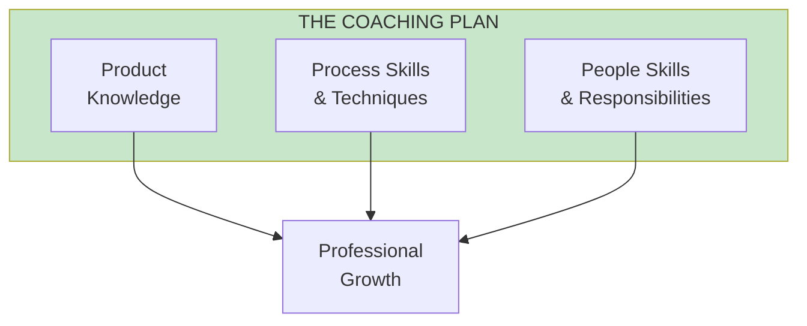
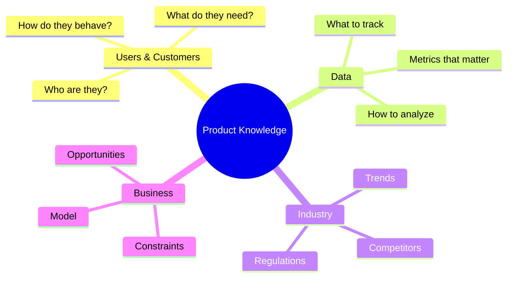

import { Aside } from '@astrojs/starlight/components';

# Chapter 9: The Coaching Plan

<Aside type="tip" title="Simply Explained">
**In one sentence:** A coaching plan is a roadmap for helping someone get better at specific things.

**Imagine this:** You want to get better at soccer. A good coach doesn't just say "play more." They say: "This month, we'll work on passing. Next month, shooting. We'll practice Tuesdays and Thursdays, and I'll give you feedback every week."

Same for work! Pick 2-3 things someone needs to improve, decide HOW they'll learn (watching others, practicing, reading), and check progress regularly.

**Remember:** Hope isn't a plan. Write down what someone needs to learn and how they'll learn it.
</Aside>

## Three Areas of Development

The coaching plan addresses three interconnected areas:

## Product Knowledge Development

## Process Skills Development

| Skill Area | Components | How to Develop |
|------------|------------|----------------|
| **Discovery** | Customer research, prototyping, testing | Pair on discovery work |
| **Delivery** | Agile practices, release planning | Coach through cycles |
| **Data Analysis** | Metrics, experiments, A/B testing | Hands-on projects |

## People Skills Development

| Skill | Why It Matters | Development Approach |
|-------|---------------|---------------------|
| **Communication** | Influences outcomes | Practice and feedback |
| **Collaboration** | Team effectiveness | Cross-functional projects |
| **Leadership** | Growing impact | Stretch assignments |

## Reflection Questions

- [ ] Does everyone on your team have a coaching plan?
- [ ] Are the plans balanced across all three areas?
- [ ] How do you track progress on development goals?

## Related Chapters

- [Chapter 8: The Assessment](/chapters/part-02-coaching/ch08-assessment/)
- [Chapter 10: The One-on-One](/chapters/part-02-coaching/ch10-one-on-one/)
