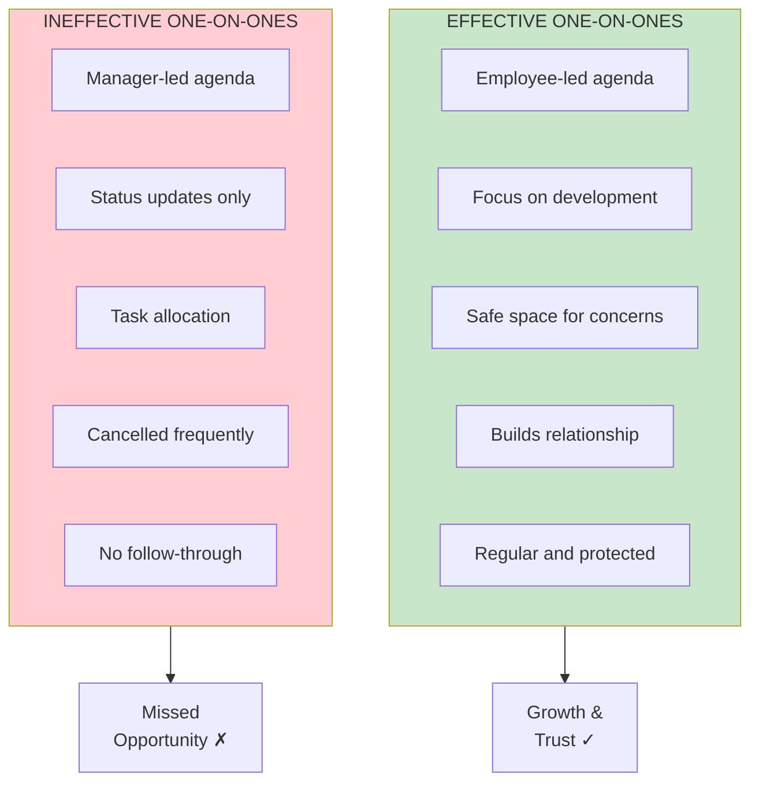
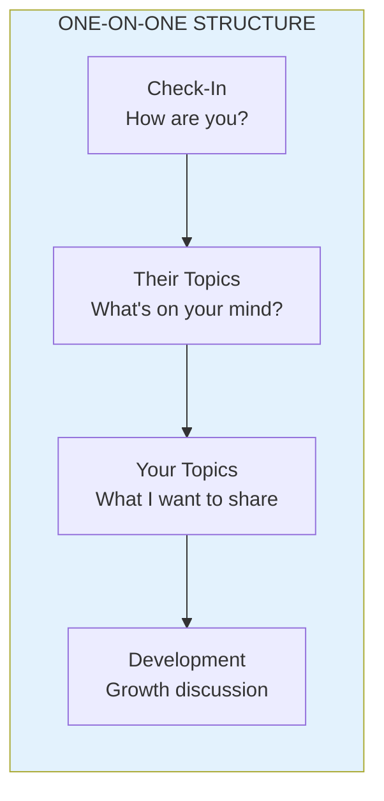

import { Aside } from '@astrojs/starlight/components';

# Chapter 10: The One-on-One

<Aside type="tip" title="Simply Explained">
**In one sentence:** One-on-ones are for THEM, not for you—it's their time to talk about what matters to them.

**Imagine this:** Your teacher schedules time just for you. If they spend the whole time asking "Did you do your homework?", that's boring and unhelpful. But if they ask "What's confusing you? What do you want to learn? How can I help?"—that's actually useful!

Good one-on-ones: THEY pick the topics. You listen more than talk. You discuss growth, not just tasks. And you NEVER cancel—it shows you care.

**Remember:** It's THEIR meeting. Let them lead. Listen more than you talk.
</Aside>

## Keys to Effective One-on-Ones

The one-on-one is the most important coaching ritual. Done well, it's transformative. Done poorly, it's a waste of time—or worse.

## One-on-One Framework

## Anti-Patterns

| Anti-Pattern | Why It's Harmful | Better Approach |
|--------------|------------------|-----------------|
| Status updates only | Misses development | Use standups for status |
| Manager talks 80%+ | Employee not heard | Listen more than talk |
| Frequently cancelled | Signals low priority | Protect the time |
| No preparation | Unfocused conversation | Both prepare topics |
| No follow-up | Actions don't happen | Track commitments |

## Sample Questions

**Opening:**
- How are you doing?
- What's on your mind?
- What would be most helpful to discuss?

**Development:**
- What are you learning?
- What's challenging you?
- What support do you need?

**Feedback:**
- What feedback do you have for me?
- How can I help you be more effective?

## Reflection Questions

- [ ] Are your one-on-ones employee-led or manager-led?
- [ ] Do you discuss development, or just work?
- [ ] How often do you cancel or reschedule?

## Related Chapters

- [Chapter 7: The Coaching Mindset](/chapters/part-02-coaching/ch07-coaching-mindset/)
- [Chapter 9: The Coaching Plan](/chapters/part-02-coaching/ch09-coaching-plan/)
