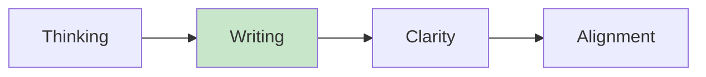

import { Aside } from '@astrojs/starlight/components';

# Chapter 11: The Written Narrative

<Aside type="tip" title="Simply Explained">
**In one sentence:** Writing things down forces you to think clearly—fuzzy ideas become sharp when you have to explain them in words.

**Imagine this:** You have an idea for a story. In your head, it seems amazing! But when you try to write it down, you realize parts don't make sense. Writing forced you to find the holes.

Same with work ideas. Before presenting a big idea in a meeting, write it down first. If you can't explain it clearly on paper, you don't understand it well enough yet.

**Remember:** If you can't write it clearly, you haven't thought it through clearly.
</Aside>

## The Power of Writing

Writing forces clarity of thought. The written narrative is a powerful tool for ensuring that complex ideas are well-formed before being communicated.

## When to Use Written Narratives

| Situation | Why Writing Helps |
|-----------|-------------------|
| **Strategy proposals** | Forces complete thinking |
| **Major decisions** | Documents reasoning |
| **Product briefs** | Creates shared understanding |
| **Retrospectives** | Captures learnings |

## Related Chapters

- [Chapter 10: The One-on-One](/chapters/part-02-coaching/ch10-one-on-one/)
- [Chapter 12: Strategic Context](/chapters/part-02-coaching/ch12-strategic-context/)
