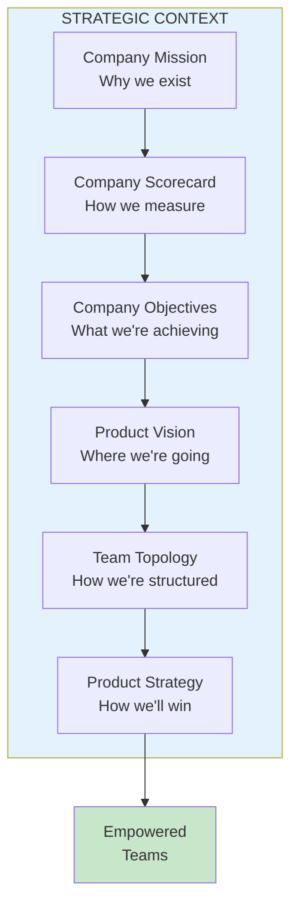
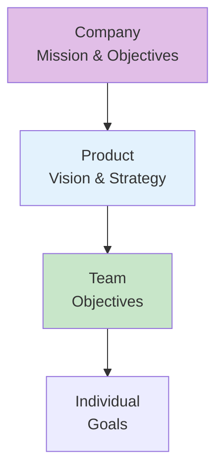

import { Aside } from '@astrojs/starlight/components';

# Chapter 12: Strategic Context

<Aside type="tip" title="Simply Explained">
**In one sentence:** People do better work when they understand WHY it matters, not just WHAT to do.

**Imagine this:** Your teacher says "Memorize these 50 vocabulary words." Boring! But if they say "We're going to write a story together, and these words will make it amazing"—suddenly you WANT to learn them.

Teams need to know: Why does this company exist? What are we trying to achieve? How does MY work fit into the big picture? Without this context, they're just following orders instead of really contributing.

**Remember:** Always share the WHY. People work harder when they understand the purpose.
</Aside>

## Why Context Matters

Teams can't be empowered without understanding the strategic context—the "why" behind their work.

## The Context Cascade

## What Teams Need to Know

| Context Element | Key Questions |
|-----------------|---------------|
| **Mission** | Why does this company exist? |
| **Scorecard** | How do we measure success? |
| **Objectives** | What are we trying to achieve? |
| **Vision** | Where are we going? |
| **Strategy** | How will we get there? |

## Reflection Questions

- [ ] Does everyone on your team understand the company mission?
- [ ] Can team members articulate how their work connects to company objectives?
- [ ] Is strategic context regularly reinforced?

## Related Chapters

- [Chapter 37: Creating a Compelling Vision](/chapters/part-04-vision/ch37-compelling-vision/)
- [Chapter 48: Focus](/chapters/part-06-strategy/ch48-focus/)
