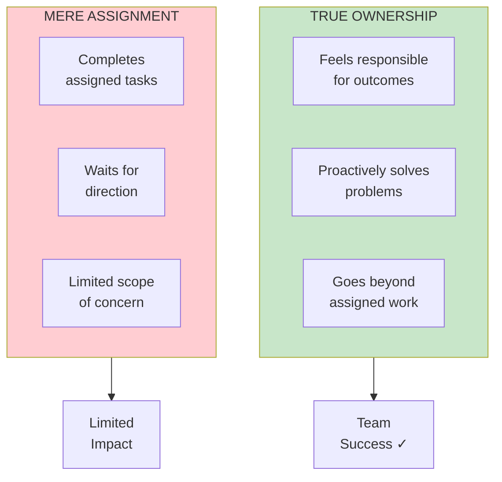
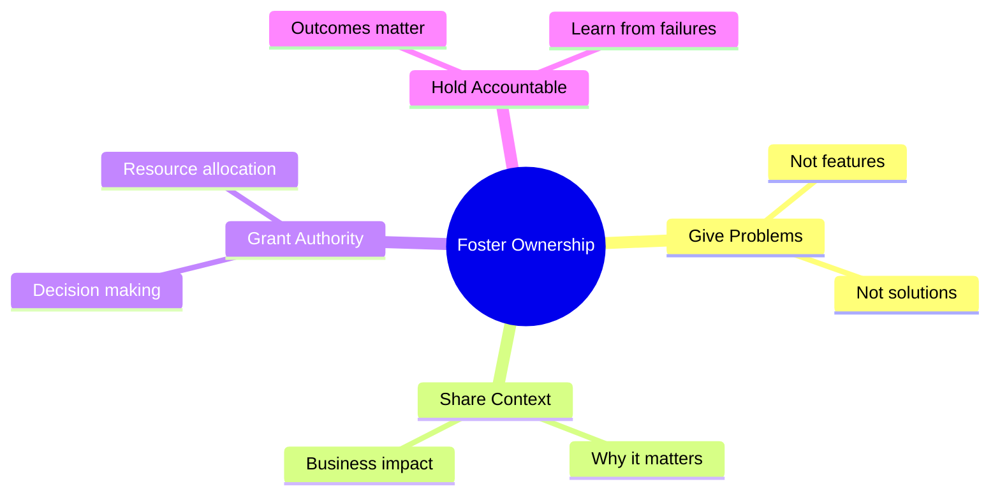

import { Aside } from '@astrojs/starlight/components';

# Chapter 13: Sense of Ownership

<Aside type="tip" title="Simply Explained">
**In one sentence:** There's a huge difference between "it's my job" and "it's my project"—ownership means you CARE about the outcome.

**Imagine this:** Cleaning your room because your parents told you to vs. organizing your own art studio because YOU want to find your supplies easily. Same activity—totally different energy and results.

When people feel like owners (not just workers), they don't wait to be told what to do. They notice problems and fix them. They go the extra mile because they CARE.

**Remember:** Give people real responsibility and let them feel the weight of it. That's how you create owners, not renters.
</Aside>

## Ownership vs Assignment

True ownership means feeling responsible for outcomes, not just completing tasks.

## How to Foster Ownership

## Related Chapters

- [Chapter 4: Empowered Product Teams](/chapters/part-01-lessons/ch04-empowered-teams/)
- [Chapter 53: Empowerment](/chapters/part-07-objectives/ch53-empowerment/)
