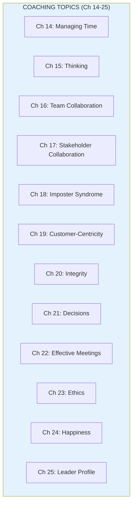
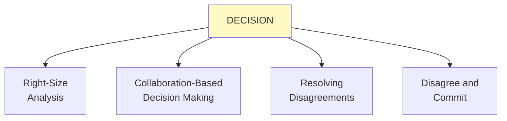

import { Aside } from '@astrojs/starlight/components';

# Chapters 14-25: Deep Coaching Topics

<Aside type="tip" title="Simply Explained">
**In one sentence:** Leaders need to help their people with all sorts of real challenges—from managing time to making tough decisions to staying happy at work.

**Imagine this:** A coach doesn't just teach basketball skills. They also help players deal with nerves before big games, work out conflicts between teammates, and stay motivated during losing streaks. Coaching is about the WHOLE person.

These chapters cover real stuff: How do you decide when you're not sure? How do you handle feeling like a fraud? How do you work well with people who annoy you? How do you stay happy when work is hard?

**Remember:** Good coaching covers everything that affects how someone shows up and performs—not just technical skills.
</Aside>

## Overview of Topics

The remaining chapters in Part II cover specific coaching topics that leaders need to address with their teams.

## Key Topics Summary

### Time Management (Ch 14)
Product people are constantly pulled in many directions. Effective time management is crucial for impact.

### Decisions (Ch 21)
Decision-making frameworks help teams make better decisions faster:

### Ethics (Ch 23)
Product teams must consider the ethical implications of their work. Leaders need to model ethical thinking.

### Happiness (Ch 24)
Happy, engaged team members produce better work. Leaders should attend to:
- Meaningful work
- Personal relationships
- Recognition
- Work habits
- Career planning

## Leader Profile: Lisa Kavanaugh (Ch 25)

Each part ends with a leader profile—a real product leader sharing their path and lessons learned.

## Related Concepts

- [Coaching Framework](/concepts/coaching-framework/)
- [Leadership](/concepts/leadership/)
