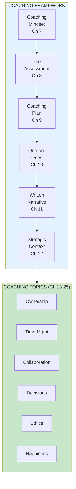
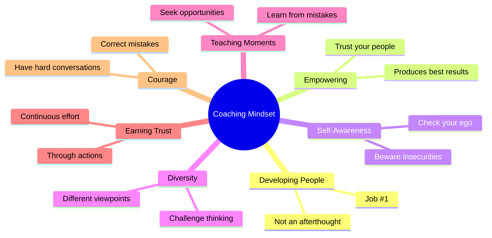

import { Aside } from '@astrojs/starlight/components';

# Part II: Coaching

**Chapters 7-25** | Developing people is job #1

<Aside type="tip" title="Simply Explained">
**In one sentence:** A leader's #1 job is helping their people get better, not telling them what to do.

**Imagine this:** Two basketball coaches. Coach A yells plays from the sidelines all game. Coach B practices with players, asks questions like "What do you think went wrong?", and helps them figure things out. Which players improve faster?

Coaching isn't about having all the answers. It's about asking good questions, listening, and helping people discover answers themselves. That's how people really grow.

**Remember:** Great leaders develop great people. Everything else follows from that.
</Aside>

## Part Overview

Coaching is perhaps the most important responsibility of a product leader. Part II covers the mindset, techniques, and practices for developing people on product teams.

## Bill Campbell on Coaching

> "Coaches roll up their sleeves and get their hands dirty. They don't just believe in our potential; they get in the arena to help us realize our potential. They hold up a mirror so we can see our blind spots and they hold us accountable for working through our sore spots. They take responsibility for making us better without taking credit for our accomplishments."

## The Coaching Mindset Principles

## Chapters in This Part

| Chapter | Title | Key Concept |
|---------|-------|-------------|
| [Ch 7](/chapters/part-02-coaching/ch07-coaching-mindset/) | The Coaching Mindset | Foundation for coaching |
| [Ch 8](/chapters/part-02-coaching/ch08-assessment/) | The Assessment | Understanding current state |
| [Ch 9](/chapters/part-02-coaching/ch09-coaching-plan/) | The Coaching Plan | Structured development |
| [Ch 10](/chapters/part-02-coaching/ch10-one-on-one/) | The One-on-One | Critical coaching ritual |
| [Ch 11](/chapters/part-02-coaching/ch11-written-narrative/) | The Written Narrative | Documenting thinking |
| [Ch 12](/chapters/part-02-coaching/ch12-strategic-context/) | Strategic Context | Sharing the why |
| [Ch 13](/chapters/part-02-coaching/ch13-ownership/) | Sense of Ownership | Creating accountability |
| [Ch 14-25](/chapters/part-02-coaching/ch14-25-deep-topics/) | Deep Coaching Topics | Time, decisions, ethics |

## Related Concepts

- [Coaching Framework](/concepts/coaching-framework/)
- [Leadership](/concepts/leadership/)
