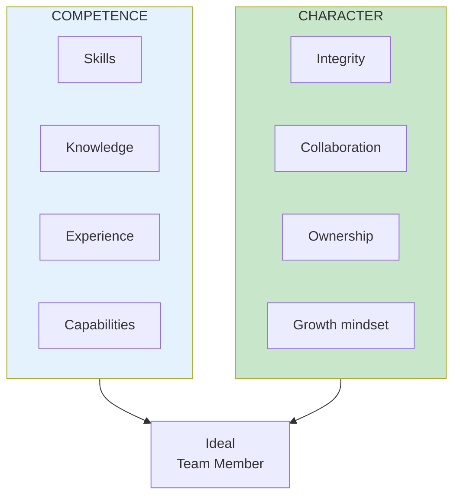

import { Aside } from '@astrojs/starlight/components';

# Chapter 26: Competence and Character

<Aside type="tip" title="Simply Explained">
**In one sentence:** You need both skills AND good character—just being talented isn't enough.

**Imagine this:** Four people want to join your basketball team:
- **Player A**: Great at basketball AND a great teammate → Perfect!
- **Player B**: Great at basketball BUT selfish and mean → Dangerous! Could wreck the team.
- **Player C**: Okay at basketball BUT works hard and helps everyone → Worth training!
- **Player D**: Bad at basketball AND bad attitude → Easy no.

The tricky one is Player B. They might score points, but they'll damage team spirit. Sometimes the "talented jerk" is worse than having nobody.

**Remember:** Character isn't optional. Someone skilled but selfish can hurt more than help.
</Aside>

## The Dual Requirement

For empowered teams, you need people with both competence (can they do the job?) and character (will they do it right?).

## The Hiring Matrix

| | High Character | Low Character |
|---|---|---|
| **High Competence** | Ideal hire ✓ | Dangerous - can do damage |
| **Low Competence** | Worth developing | Don't hire ✗ |

## Why Character Matters

Someone with high competence but low character can be more dangerous than helpful. They might:
- Undermine team collaboration
- Put personal interests above team goals
- Damage trust with stakeholders
- Create toxic culture

## Related Chapters

- [Chapter 27-36: Hiring & People Management](/chapters/part-03-staffing/ch27-36-hiring/)
