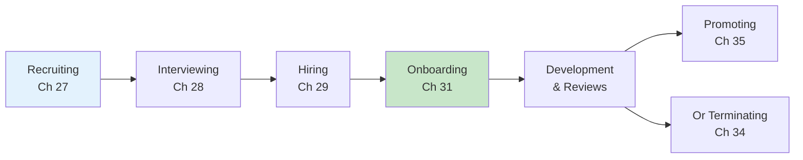

import { Aside } from '@astrojs/starlight/components';

# Chapters 27-36: Hiring & People Management

<Aside type="tip" title="Simply Explained">
**In one sentence:** Taking care of people means thinking about the whole journey—from finding them, to welcoming them, to helping them grow (or sometimes, saying goodbye).

**Imagine this:** A sports team doesn't just recruit players and forget about them. They welcome new players, train them, give them feedback, help them improve, and sometimes have to make hard decisions about who stays.

Same at work! You need to: find good people (recruiting), see if they're really good (interviewing), welcome them properly (onboarding), help them grow (reviews), and celebrate their progress (promoting). It's a whole cycle.

**Remember:** Hiring is just the beginning. What happens after matters even more.
</Aside>

## The Employee Lifecycle

## Key Topics

### Recruiting (Ch 27)
Active recruiting is essential—don't wait for candidates to come to you.

### Interviewing (Ch 28)
Structure interviews to assess both competence and character.

### Remote Employees (Ch 30)
Remote work requires intentional practices around artifacts, trust, and time.

### Performance Reviews (Ch 33)
Regular, honest feedback—not just annual reviews.

### Promoting (Ch 35)
Promote based on demonstrated capability, not tenure.

## Related Chapters

- [Chapter 26: Competence and Character](/chapters/part-03-staffing/ch26-competence-character/)
