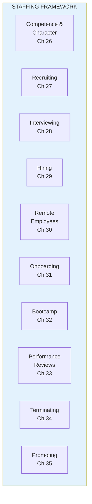
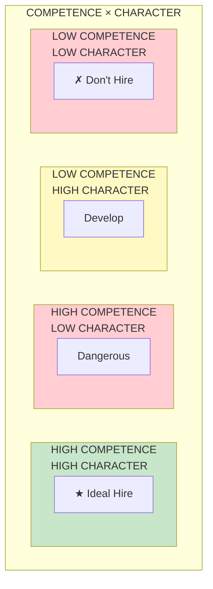

import { Aside } from '@astrojs/starlight/components';

# Part III: Staffing

**Chapters 26-36** | Building teams with the right people

<Aside type="tip" title="Simply Explained">
**In one sentence:** Hire people who are both good at their job AND good humans—you need both.

**Imagine this:** You're picking teammates for a group project. Would you rather have someone who's super smart but steals credit and argues with everyone? Or someone who's pretty good AND actually helps the team work better together?

The best teams have people who can do the work (that's competence) AND who treat others well (that's character). Someone brilliant but mean can actually hurt the team more than help it.

**Remember:** Skills matter, but so does being a good teammate. Hire for both.
</Aside>

## Part Overview

Staffing is about getting the right people on your team. This goes beyond skills—it's about finding people with both the competence and character to be part of an empowered team.

## Competence and Character

Both matter equally for empowered teams:

## Chapters in This Part

| Chapter | Title | Key Concept |
|---------|-------|-------------|
| [Ch 26](/chapters/part-03-staffing/ch26-competence-character/) | Competence and Character | Both are required |
| [Ch 27-36](/chapters/part-03-staffing/ch27-36-hiring/) | Hiring & People Management | Full lifecycle |

## Related Concepts

- [Empowered Teams](/concepts/empowered-teams/)
- [Leadership](/concepts/leadership/)
