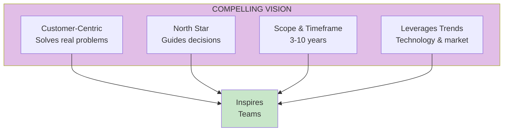

import { Aside } from '@astrojs/starlight/components';

# Chapter 37: Creating a Compelling Vision

<Aside type="tip" title="Simply Explained">
**In one sentence:** A great vision paints a picture of how you'll help customers in the future—and makes people excited to build it.

**Imagine this:** "We'll make the best word processor" is boring. But "Imagine a world where anyone can write beautifully, even if they can't spell"—that's exciting! You can SEE it.

Good visions: (1) Focus on customers, not technology, (2) Look 3-10 years ahead, (3) Are ambitious but believable, and (4) Ride the wave of where technology is heading.

**Remember:** A vision should make people say "Wow, I want to help build that!"
</Aside>

## Vision Framework

A compelling product vision has four key characteristics:

## Customer-Centric Vision

The vision should be about the value created for customers, not about the company or technology.

## North Star Function

The vision serves as a north star—a constant reference point for all decisions.

## Scope and Timeframe

Vision should be:
- **3-10 years out**: Far enough to be ambitious, close enough to be relevant
- **Broad enough**: To inspire, not constrain
- **Specific enough**: To guide decisions

## Leveraging Trends

Great visions anticipate and leverage technology and market trends.

## Related Chapters

- [Chapter 38-40: Sharing & Principles](/chapters/part-04-vision/ch38-40-sharing/)
