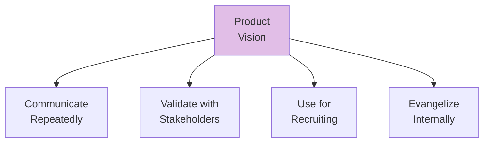
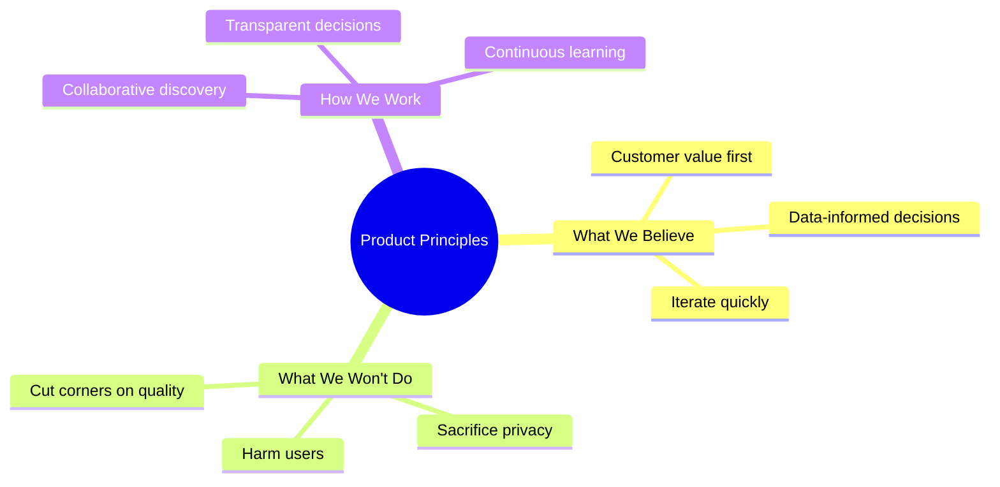

import { Aside } from '@astrojs/starlight/components';

# Chapters 38-40: Sharing Vision & Principles

<Aside type="tip" title="Simply Explained">
**In one sentence:** A vision only works if everyone knows it—and principles are the rules you'll never break while getting there.

**Imagine this:** Having an amazing treasure map but keeping it secret? Useless! You need to share it, talk about it constantly, and use it to recruit others to join your quest.

Principles are your promises: "We'll never cheat to win. We'll always be honest with customers. We'll never ship something we're not proud of." These are lines you won't cross, no matter what.

**Remember:** Share the vision over and over. Set principles that keep you honest on the journey.
</Aside>

## Sharing the Product Vision (Ch 38)

A vision is only valuable if it's shared effectively:

## Product Principles and Ethics (Ch 39)

Product principles guide decision-making. They should include ethical considerations:

## Related Chapters

- [Chapter 37: Creating a Compelling Vision](/chapters/part-04-vision/ch37-compelling-vision/)
