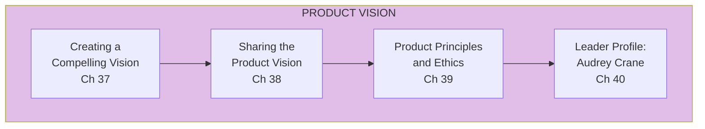
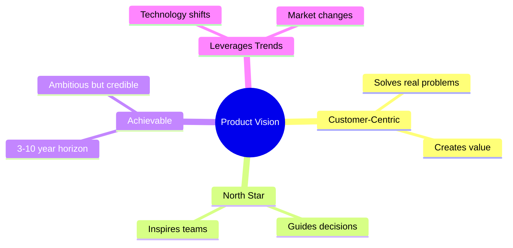

import { Aside } from '@astrojs/starlight/components';

# Part IV: Product Vision and Principles

**Chapters 37-40** | The north star for empowered teams

<Aside type="tip" title="Simply Explained">
**In one sentence:** Vision is your picture of an amazing future—it helps everyone know where you're going and get excited about getting there.

**Imagine this:** Your class wants to put on a play. Without a vision, people argue about everything. But if someone says "Let's create a magical show that makes the audience laugh AND cry!"—suddenly everyone knows what they're aiming for.

A good vision is far enough away to be exciting (maybe 3-5 years out), but clear enough that people can imagine it. It answers: "What amazing thing are we building, and why will people love it?"

**Remember:** Without a compelling vision, teams just wander. With one, they march together.
</Aside>

## Part Overview

Product vision is the north star that guides empowered teams. Without a compelling vision, teams lack direction and motivation.

## Vision Characteristics

A compelling product vision is:

## Chapters in This Part

| Chapter | Title | Key Concept |
|---------|-------|-------------|
| [Ch 37](/chapters/part-04-vision/ch37-compelling-vision/) | Creating a Compelling Vision | Vision characteristics |
| [Ch 38-40](/chapters/part-04-vision/ch38-40-sharing/) | Sharing & Principles | Communication & ethics |

## Related Concepts

- [Product Vision](/concepts/product-vision/)
- [The Product Model](/concepts/product-model/)
