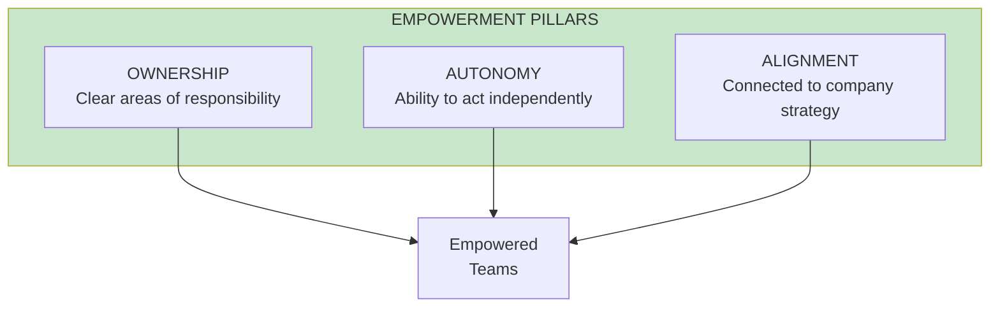
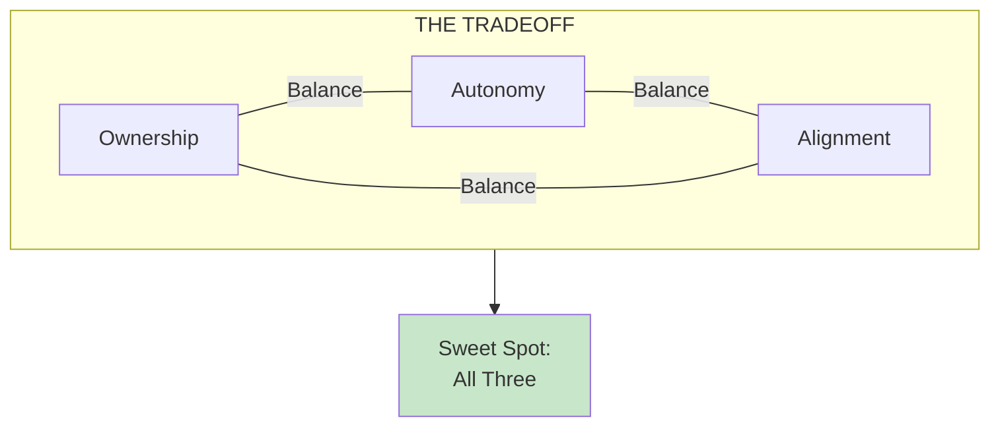

import { Aside } from '@astrojs/starlight/components';

# Chapter 41: Optimizing for Empowerment

<Aside type="tip" title="Simply Explained">
**In one sentence:** Teams work best when they own something clearly, can act without asking permission constantly, AND understand how their work connects to the big picture.

**Imagine this:** Three things make a great group project: (1) **Ownership** - everyone knows what part they're responsible for, (2) **Autonomy** - you can work without constantly asking the teacher for approval, (3) **Alignment** - everyone agrees on what "done" looks like.

Miss any one of these and problems happen: unclear ownership means nobody feels responsible; no autonomy means everything takes forever; no alignment means people build different things.

**Remember:** Ownership + Autonomy + Alignment = Empowered teams. You need all three.
</Aside>

## Three Pillars

Team topology should optimize for three things:

## Ownership

Teams need clear ownership of:
- A specific area of the product
- Specific customer problems
- Specific business outcomes

## Autonomy

Teams need the ability to:
- Make decisions about their area
- Ship without excessive dependencies
- Iterate quickly on solutions

## Alignment

Teams need connection to:
- Company mission and objectives
- Product vision and strategy
- Other teams' work

## The Tradeoff Triangle

## Related Chapters

- [Chapter 42: Team Types](/chapters/part-05-topology/ch42-team-types/)
