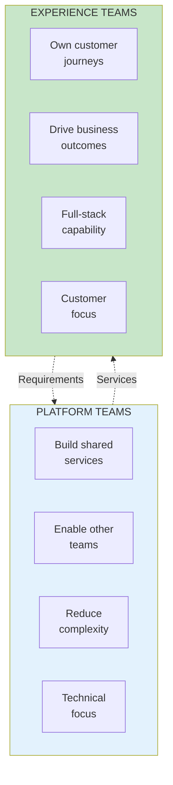

import { Aside } from '@astrojs/starlight/components';

# Chapter 42: Team Types

<Aside type="tip" title="Simply Explained">
**In one sentence:** Some teams build things for OTHER teams to use (platforms); some teams build things directly for customers (experiences).

**Imagine this:** A school play has two kinds of helpers. The **stage crew** (platform team) builds the set, handles lighting, and makes microphones work—they help the ACTORS do their job better. The **actors** (experience team) perform directly for the audience.

Both are essential! Without stage crew, actors can't perform well. Without actors, there's no show. Platform teams make experience teams more powerful.

**Remember:** Platform teams serve other teams. Experience teams serve customers. Both are needed.
</Aside>

## Two Primary Team Types

## Platform Teams

Platform teams provide capabilities that other teams build upon:

| Characteristic | Description |
|---------------|-------------|
| **Customers** | Other product teams |
| **Success metric** | Team adoption, reliability |
| **Focus** | Technical capability |
| **Autonomy source** | Platform objectives |

## Experience Teams

Experience teams own customer-facing journeys:

| Characteristic | Description |
|---------------|-------------|
| **Customers** | End users |
| **Success metric** | Business outcomes |
| **Focus** | Customer problems |
| **Autonomy source** | Customer objectives |

## Related Chapters

- [Chapter 43-47: Platform & Experience Teams](/chapters/part-05-topology/ch43-47-teams/)
