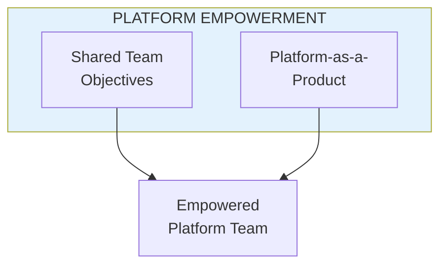
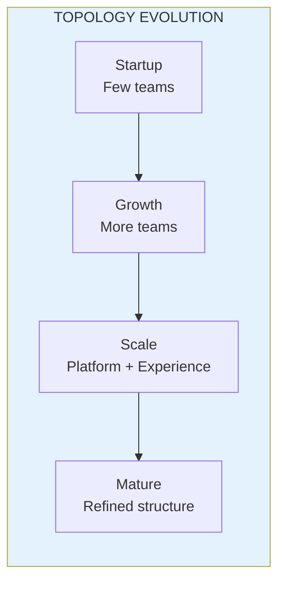

import { Aside } from '@astrojs/starlight/components';

# Chapters 43-47: Platform & Experience Teams

<Aside type="tip" title="Simply Explained">
**In one sentence:** Both platform teams and experience teams can be empowered—they just need different things.

**Imagine this:** The school kitchen team and the serving team both want to do great work. Kitchen team needs: good equipment, clear food quality standards, feedback from diners. Serving team needs: understanding what diners want, freedom to be friendly their own way, connection to the kitchen.

As a company grows, the structure changes too. Small startup = everyone does everything. Bigger company = more specialized teams. The key is evolving your structure as you grow—what works for 10 people doesn't work for 100.

**Remember:** Different team types need different kinds of support. And your structure should evolve as you grow.
</Aside>

## Empowering Platform Teams (Ch 43)

Platform teams can be empowered through:

## Empowering Experience Teams (Ch 44)

Different product types require different approaches:
- Media products
- E-commerce products
- Enterprise products
- Marketplace products
- Customer-enabling products

## Topology and Proximity (Ch 45)

Physical and organizational proximity affects team effectiveness.

## Topology Evolution (Ch 46)

Topologies should evolve as the company grows and learns:

## Warning Signs

Watch for these topology problems:
- Too many dependencies between teams
- Unclear ownership
- Teams fighting over scope
- No platform investment

## Related Concepts

- [Team Topology](/concepts/team-topology/)
