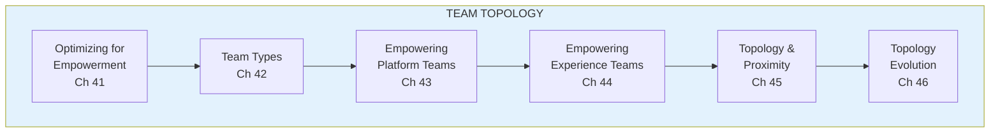
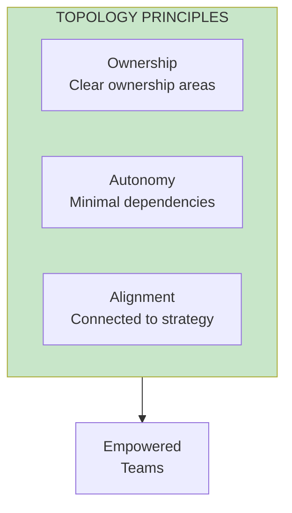
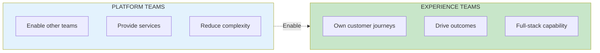

import { Aside } from '@astrojs/starlight/components';

# Part V: Team Topology

**Chapters 41-47** | Structuring teams for success

<Aside type="tip" title="Simply Explained">
**In one sentence:** How you organize teams matters—the right structure lets teams work independently, the wrong structure makes everyone wait on everyone else.

**Imagine this:** A pizza restaurant. Bad structure: one person takes orders, makes pizza, AND delivers—bottleneck! Good structure: one team takes orders, another makes pizzas, another delivers. They work at the same time, not waiting in line.

There are two main team types: **Platform teams** build tools that other teams use (like the kitchen). **Experience teams** directly serve customers (like the delivery drivers). Both need to work together smoothly.

**Remember:** Structure your teams so they can run fast without constantly waiting for each other.
</Aside>

## Part Overview

Team topology is about how you structure your product teams. The right structure enables empowerment; the wrong structure prevents it.

## Key Principles

## Team Types

## Chapters in This Part

| Chapter | Title | Key Concept |
|---------|-------|-------------|
| [Ch 41](/chapters/part-05-topology/ch41-optimizing/) | Optimizing for Empowerment | Ownership, autonomy, alignment |
| [Ch 42](/chapters/part-05-topology/ch42-team-types/) | Team Types | Platform vs experience |
| [Ch 43-47](/chapters/part-05-topology/ch43-47-teams/) | Platform & Experience Teams | Empowering each type |

## Related Concepts

- [Team Topology](/concepts/team-topology/)
- [Empowered Teams](/concepts/empowered-teams/)
