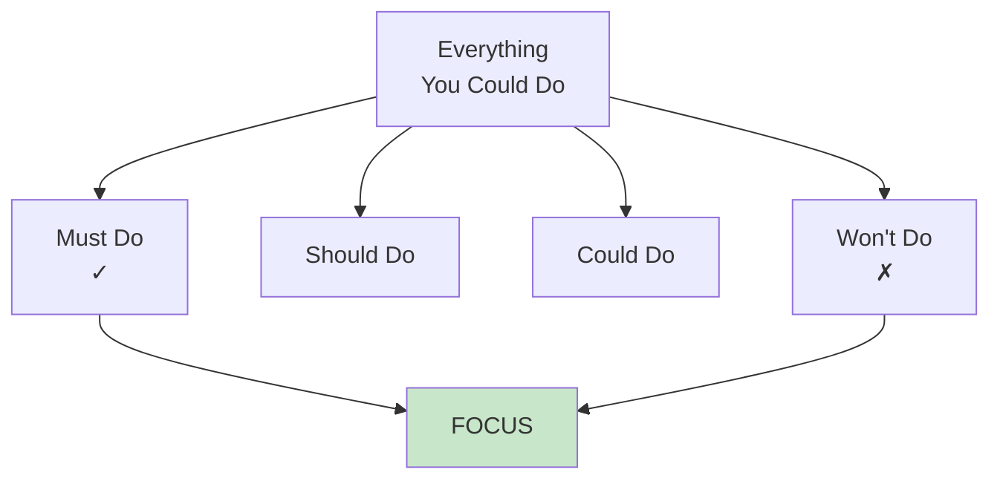
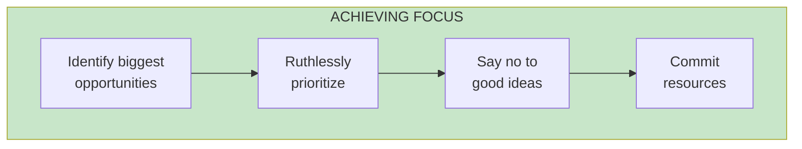

import { Aside } from '@astrojs/starlight/components';

# Chapter 48: Focus

<Aside type="tip" title="Simply Explained">
**In one sentence:** Focus means saying NO to good things so you can say YES to the best things.

**Imagine this:** You have 10 hours to study for 5 tests. You could spread thin—2 hours each, probably get C's on everything. OR you could focus—5 hours on the 2 most important tests, ace those, and do your best on the rest.

The hardest part of strategy isn't picking what to do—it's picking what NOT to do. Every "yes" means saying "no" to something else. Great companies are great at saying no.

**Remember:** You can't be great at everything. Pick your battles and go all-in.
</Aside>

## The Power of Focus

Strategy is as much about what you don't do as what you do. Focus means making hard choices.

## Why Focus Matters

| Unfocused | Focused |
|-----------|---------|
| Spread thin | Concentrated effort |
| Average at everything | Excellent at few things |
| Slow progress | Fast progress |
| Confused teams | Clear direction |

## How to Focus

## Related Chapters

- [Chapter 49: Insights](/chapters/part-06-strategy/ch49-insights/)
