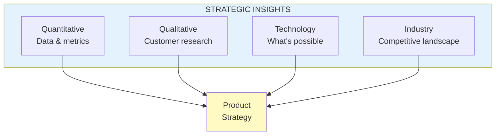

import { Aside } from '@astrojs/starlight/components';

# Chapter 49: Insights

<Aside type="tip" title="Simply Explained">
**In one sentence:** Good strategy is built on things you KNOW—from data, from talking to customers, from understanding technology and competition.

**Imagine this:** A detective doesn't guess who did it—they gather clues. Numbers (how many? how often?), interviews (what do people say?), context (what else is happening?), and expertise (what's even possible?).

Strategy without insights is just guessing. You need: data about what's happening, research about what customers want, knowledge about what technology can do, and awareness of what competitors are doing.

**Remember:** Gather evidence before making big decisions. Insights turn hunches into confident strategies.
</Aside>

## Types of Insights

Good strategy is grounded in insights from multiple sources:

## Shared Learnings

Insights should be shared across the organization, not siloed in individual teams.

## Related Chapters

- [Chapter 48: Focus](/chapters/part-06-strategy/ch48-focus/)
- [Chapter 50-52: Actions & Management](/chapters/part-06-strategy/ch50-52-actions/)
