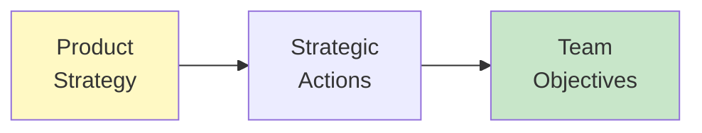

import { Aside } from '@astrojs/starlight/components';

# Chapters 50-52: Actions & Management

<Aside type="tip" title="Simply Explained">
**In one sentence:** Strategy isn't real until you turn it into specific actions—and then actually track whether they're working.

**Imagine this:** "Get healthier" is a wish. "Run 3 times a week, eat vegetables at every meal, sleep 8 hours" is a plan. And checking your progress weekly is management.

Same with product strategy: You need specific actions (what will we DO?), and you need to track progress (is it working?). If something isn't working, you adjust. That's strategy management.

**Remember:** Strategy → Actions → Track Progress → Adjust. Repeat forever.
</Aside>

## Actions (Ch 50)

Actions are the specific things you'll do to execute your strategy:

## Management (Ch 51)

Strategy requires ongoing management:

- **Tracking**: Are we making progress?
- **Learning**: What are we discovering?
- **Adapting**: How should we adjust?

## Leader Profile (Ch 52)

Part VI concludes with a leader profile—Shan-Lyn Ma sharing her approach to product strategy.

## Related Chapters

- [Chapter 48: Focus](/chapters/part-06-strategy/ch48-focus/)
- [Chapter 53: Empowerment](/chapters/part-07-objectives/ch53-empowerment/)
