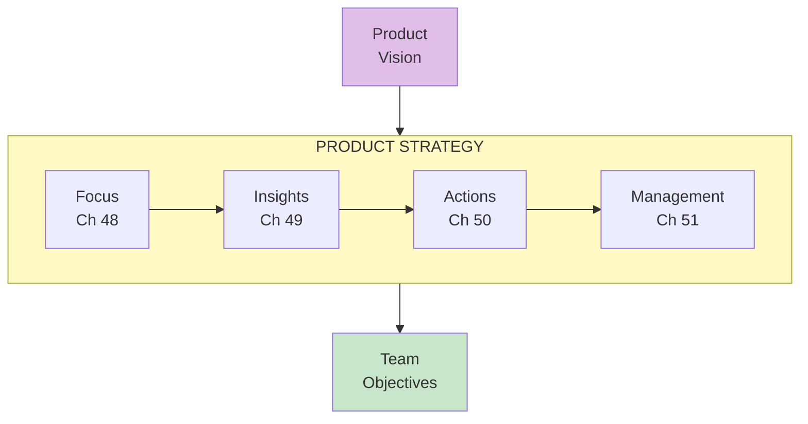
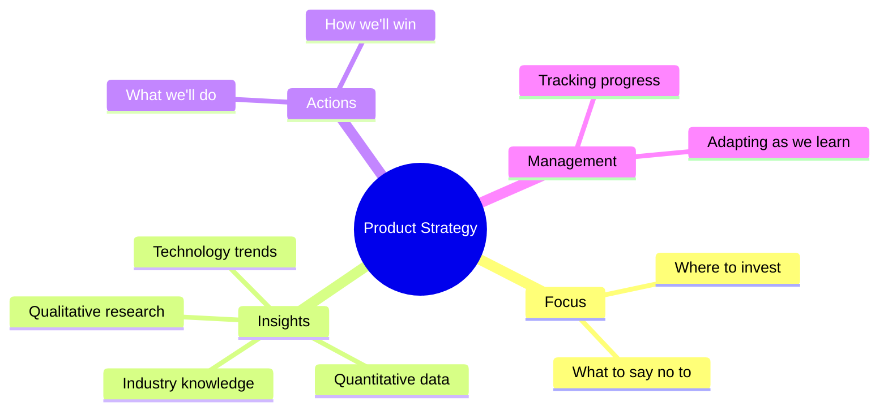

import { Aside } from '@astrojs/starlight/components';

# Part VI: Product Strategy

**Chapters 48-52** | How to win in your market

<Aside type="tip" title="Simply Explained">
**In one sentence:** Strategy is your game plan for winning—it connects your big dream (vision) to what teams actually work on day-to-day.

**Imagine this:** Vision is "win the championship." Strategy is "focus on defense this season, recruit a strong point guard, and practice free throws every day." Without strategy, vision is just a wish.

Good strategy answers: Where should we focus? What do we know that others don't? What will we actually DO? And it requires saying NO to good ideas so you can say YES to great ones.

**Remember:** Strategy = Focus + Insights + Actions. It's how you turn dreams into plans.
</Aside>

## Part Overview

Product strategy is about deciding where to focus and how to win. It bridges vision (where we're going) and execution (what teams work on).

## Strategy Components

## Chapters in This Part

| Chapter | Title | Key Concept |
|---------|-------|-------------|
| [Ch 48](/chapters/part-06-strategy/ch48-focus/) | Focus | The power of saying no |
| [Ch 49](/chapters/part-06-strategy/ch49-insights/) | Insights | Data-driven strategy |
| [Ch 50-52](/chapters/part-06-strategy/ch50-52-actions/) | Actions & Management | Execution |

## Related Concepts

- [The Product Model](/concepts/product-model/)
- [Product Vision](/concepts/product-vision/)
