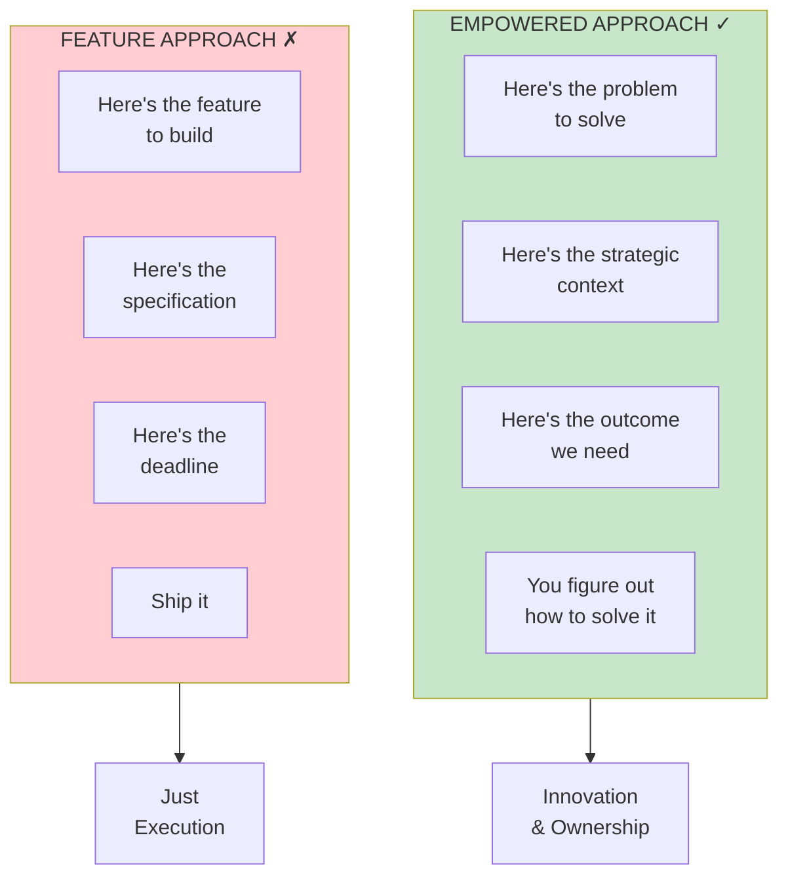
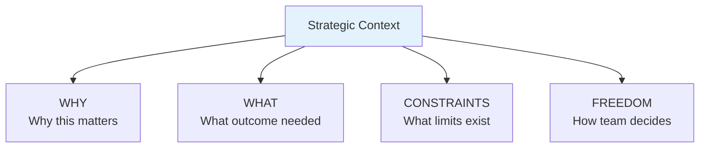

import { Aside } from '@astrojs/starlight/components';

# Chapter 53: Empowerment

<Aside type="tip" title="Simply Explained">
**In one sentence:** Real empowerment means telling teams WHAT problem to solve, not HOW to solve it.

**Imagine this:** "Build a blue button that says 'Buy Now' in the top right corner" vs. "More people should complete their purchases—figure out how to make that happen."

The first one is a feature request—no thinking required. The second is a problem to solve—the team gets to be creative, try things, and find the best answer. They'll probably come up with something better than a blue button!

**Remember:** Share the problem and the context. Let the team discover the solution.
</Aside>

## The Core Principle

True empowerment means giving teams **problems to solve**, not **features to build**.

## Sharing Strategic Context

Teams need context to solve problems well:

## Related Chapters

- [Chapter 4: Empowered Product Teams](/chapters/part-01-lessons/ch04-empowered-teams/)
- [Chapter 54: Assignment](/chapters/part-07-objectives/ch54-assignment/)
