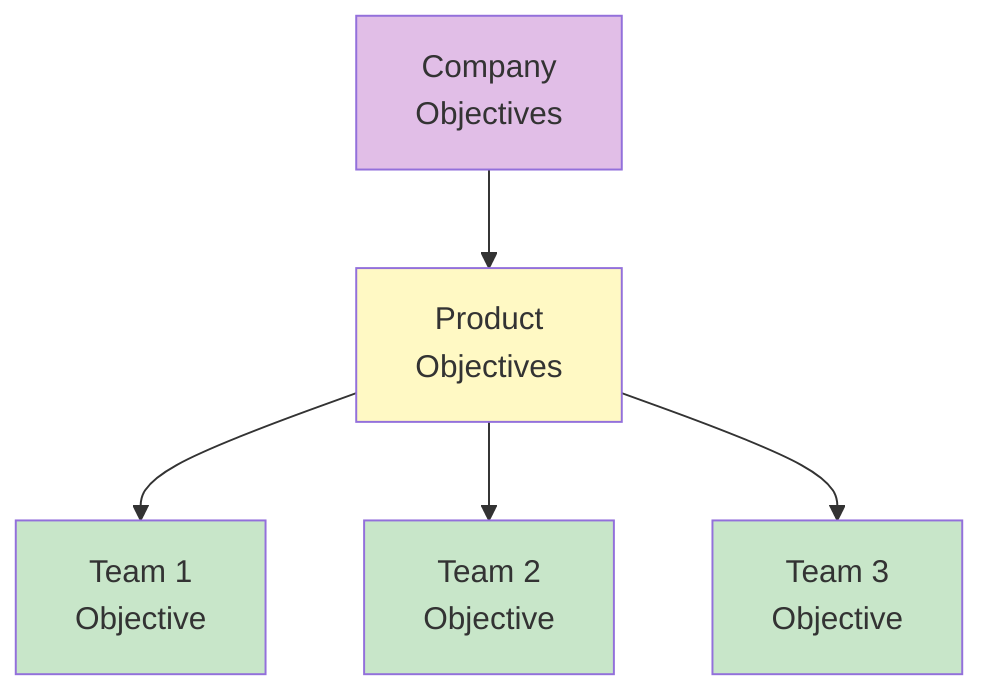

import { Aside } from '@astrojs/starlight/components';

# Chapter 54: Assignment

<Aside type="tip" title="Simply Explained">
**In one sentence:** Objectives flow down like a waterfall—company goals become team goals, and each team's piece should connect to the whole.

**Imagine this:** School wants to "be the best school in the district." That becomes: "Math department: improve test scores. Sports: win more games. Arts: put on an amazing play." Each group has their own goal, but they all connect to the big goal.

Also important: not EVERYTHING is a goal. Some work is just keeping things running—like cleaning the school or maintaining equipment. Teams need time for that too.

**Remember:** Goals should cascade from company → teams, and everyone should see how their piece fits the puzzle.
</Aside>

## Assigning Objectives to Teams

Objectives should be assigned thoughtfully:

## Determining Key Results

Key results should be:
- **Measurable**: Clear success criteria
- **Outcome-focused**: Business results, not output
- **Ambitious but achievable**: Stretch goals

## Alignment

Objectives must align:
- Vertically with company objectives
- Horizontally with other teams

## Keep-the-Lights-On Work

Not everything is objectives-based. Teams also have maintenance work that needs capacity.

## Related Chapters

- [Chapter 53: Empowerment](/chapters/part-07-objectives/ch53-empowerment/)
- [Chapter 55-61: OKR Framework](/chapters/part-07-objectives/ch55-61-okrs/)
