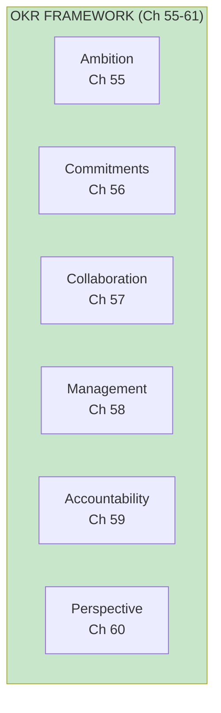
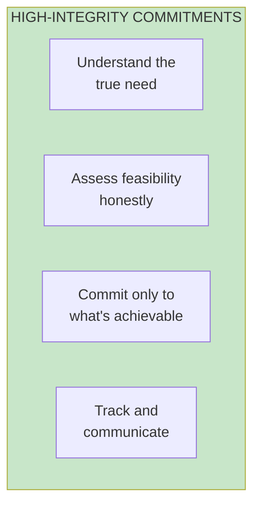

import { Aside } from '@astrojs/starlight/components';

# Chapters 55-61: OKR Framework

<Aside type="tip" title="Simply Explained">
**In one sentence:** OKRs are goals (Objectives) plus scorecards (Key Results) that help teams aim high, track progress, and stay accountable.

**Imagine this:** Your goal: "Become a better basketball player." That's the Objective. Your Key Results: "Make 8/10 free throws, run a mile in under 8 minutes, play in 20 games this season." Now you know exactly how to measure if you're getting better!

Important pieces: Goals should be AMBITIOUS (stretch yourself!), promises should be HONEST (don't commit to what you can't deliver), and you should check progress WEEKLY (not just at the end).

**Remember:** OKRs are a helpful tool, not a religion. Use them to aim high and track progress.
</Aside>

## Overview

## Ambition (Ch 55)

Objectives should be ambitious—stretch goals that drive teams to do their best work.

## High-Integrity Commitments (Ch 56)

When the business needs a commitment, use high-integrity commitments:

## Collaboration (Ch 57)

Teams often need to collaborate on shared objectives.

## Management (Ch 58)

OKRs require ongoing management:
- Weekly tracking
- Staying on track
- Helping colleagues

## Accountability (Ch 59)

Empowerment comes with accountability—teams own outcomes, not just output.

## Objectives in Perspective (Ch 60)

OKRs are a tool, not a religion. Keep them in perspective.

## Related Concepts

- [OKR Framework](/concepts/okr-framework/)
