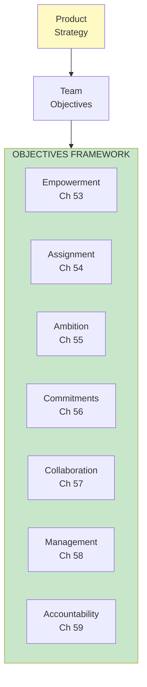
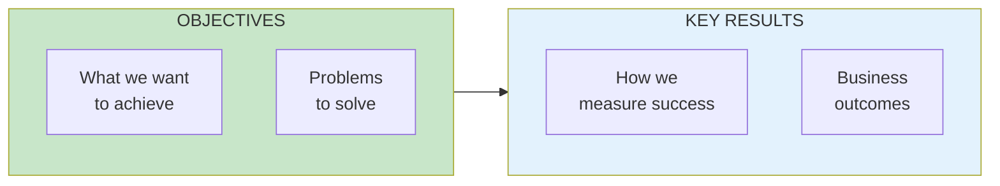

import { Aside } from '@astrojs/starlight/components';

# Part VII: Team Objectives

**Chapters 53-61** | Giving teams problems to solve

<Aside type="tip" title="Simply Explained">
**In one sentence:** Give teams PROBLEMS to solve (not features to build), and measure success by RESULTS (not just completing tasks).

**Imagine this:** Two ways to assign homework. Teacher A: "Write a 500-word essay about dogs." Teacher B: "Help the class understand why dogs make great pets. You decide how to do it—could be an essay, a presentation, a video, whatever works."

Same learning, but Teacher B's students are more engaged because they OWN the how. OKRs work the same way: Objective = problem to solve, Key Results = how you'll know you succeeded.

**Remember:** Assign problems and outcomes. Let teams figure out the solutions.
</Aside>

## Part Overview

Team objectives are how strategy connects to empowered teams. The key is giving teams problems to solve, not features to build.

## The OKR Barbell

## Chapters in This Part

| Chapter | Title | Key Concept |
|---------|-------|-------------|
| [Ch 53](/chapters/part-07-objectives/ch53-empowerment/) | Empowerment | Problems, not features |
| [Ch 54](/chapters/part-07-objectives/ch54-assignment/) | Assignment | How to assign objectives |
| [Ch 55-61](/chapters/part-07-objectives/ch55-61-okrs/) | OKR Framework | Full OKR implementation |

## Related Concepts

- [OKR Framework](/concepts/okr-framework/)
- [Empowered Teams](/concepts/empowered-teams/)
