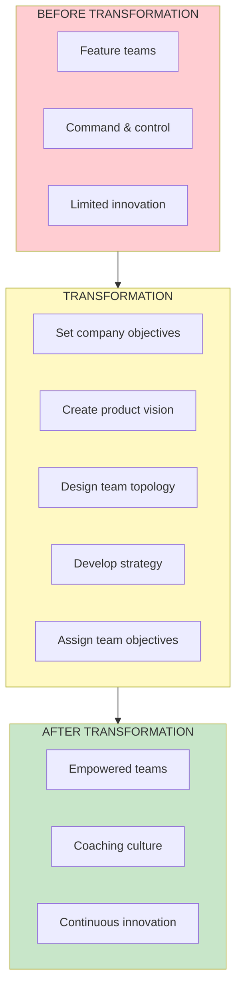

import { Aside } from '@astrojs/starlight/components';

# Full Case Study

<Aside type="tip" title="Simply Explained">
**In one sentence:** This is the before, during, and after story of a company that went from "teams just do what they're told" to "teams solve important problems."

**Imagine this:** A school that used to be boring (teachers lecture, students memorize) decides to change. They start letting students work on real projects, ask their own questions, and figure things out. At first it's messy. But eventually? Students are engaged, learning more, and actually excited about school.

Companies can make the same transformation. It takes time, leadership has to change first, and there will be bumps. But the result—people doing their best work—is worth it.

**Remember:** Transformation is hard but possible. It starts with leaders and takes patience.
</Aside>

## The Transformation Journey

## Key Takeaways

1. **Transformation takes time** - but progress can be quick
2. **Start with leadership** - they must change first
3. **Focus on people** - skills and mindset matter
4. **Be patient but persistent** - setbacks are normal
5. **Celebrate progress** - momentum matters

## Related Concepts

- [Transformation](/concepts/transformation/)
