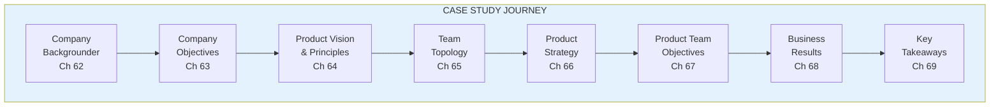

import { Aside } from '@astrojs/starlight/components';

# Part VIII: Case Study

**Chapters 62-70** | Transformation in practice

<Aside type="tip" title="Simply Explained">
**In one sentence:** This is a story about a made-up company that shows how all the ideas in this book fit together in real life.

**Imagine this:** You've learned individual basketball skills—dribbling, shooting, passing. But how does it all come together in a real game? You need to watch a full game to see how the pieces connect.

This case study is that full game. It follows a company from being "just okay" to becoming truly empowered—setting goals, creating vision, organizing teams, building strategy, and seeing results. It shows that transformation IS possible.

**Remember:** Reading about ideas is good. Seeing them in action makes them real.
</Aside>

## Part Overview

Part VIII presents a fictional case study showing how all the concepts come together in a real transformation journey.

## What You'll Learn

The case study demonstrates:
- How to set company objectives
- How to create product vision
- How to design team topology
- How to develop product strategy
- How to assign team objectives
- How to measure results

## Chapters in This Part

| Chapter | Title | Key Concept |
|---------|-------|-------------|
| [Full Case Study](/chapters/part-08-casestudy/full-case/) | Complete Story | All chapters together |

## Related Concepts

- [Transformation](/concepts/transformation/)
- [The Product Model](/concepts/product-model/)
