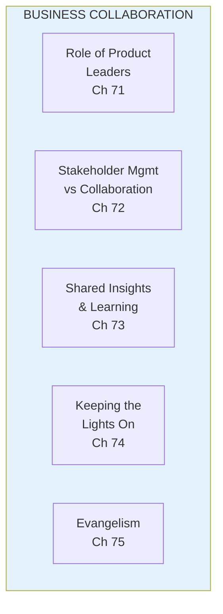
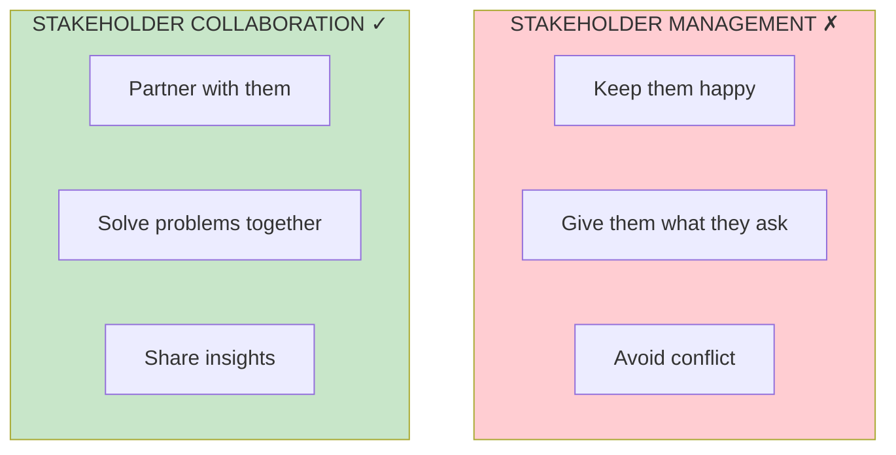

import { Aside } from '@astrojs/starlight/components';

# Part IX: Business Collaboration

**Chapters 71-76** | Partnering with the business

<Aside type="tip" title="Simply Explained">
**In one sentence:** Product teams can't succeed alone—they need to work WITH other people in the company, not just FOR them.

**Imagine this:** The school play needs the drama club, but also needs help from the art department (sets), the music class (sound), and the office (promotion). If drama club just tells everyone what to do, people get annoyed. But if they PARTNER—share ideas, listen to concerns, celebrate together—the whole show is better.

There's a big difference between "managing" people (keeping them happy, avoiding conflict) and truly "collaborating" (solving problems together, sharing wins). Collaboration builds trust.

**Remember:** Treat business partners as partners, not as people to manage or avoid.
</Aside>

## Part Overview

Empowered product teams don't work in isolation. Part IX covers how to collaborate effectively with business stakeholders.

## Stakeholder Collaboration vs Management

## Chapters in This Part

| Chapter | Title | Key Concept |
|---------|-------|-------------|
| [Stakeholder & Evangelism](/chapters/part-09-collaboration/stakeholder-evangelism/) | Full Coverage | All collaboration topics |

## Related Concepts

- [Leadership](/concepts/leadership/)
