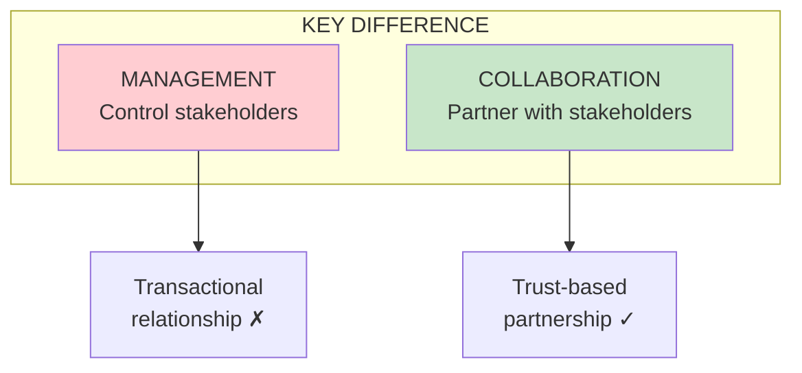

import { Aside } from '@astrojs/starlight/components';

# Stakeholder Collaboration & Evangelism

<Aside type="tip" title="Simply Explained">
**In one sentence:** Build real partnerships with business people, and spread the word about what your team is achieving.

**Imagine this:** Two kids selling lemonade. One just makes lemonade and waits. The other goes around the neighborhood, tells people about it, gets neighbors excited, and asks what flavors they'd like. Same lemonade—totally different results.

"Evangelism" means being enthusiastic about your work and sharing it widely. You don't have to brag—just consistently share your vision, celebrate wins, and build relationships. People support what they understand.

**Remember:** Don't hide in your corner. Share your wins, your vision, and your enthusiasm.
</Aside>

## The Role of Product Leaders (Ch 71)

Product leaders have three key responsibilities with stakeholders:
- Delivering business results
- Communicating product strategy
- Enabling product teams

## Collaboration vs Management (Ch 72)

## Evangelism (Ch 75)

Evangelism is about building support for your product and team:
- Share the vision consistently
- Celebrate wins
- Build relationships

## Related Chapters

- [Part IX Overview](/chapters/part-09-collaboration/overview/)
