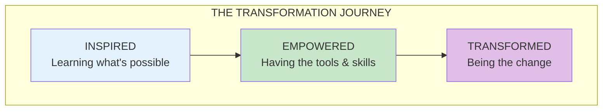

import { Aside } from '@astrojs/starlight/components';

# The Transformation Journey

<Aside type="tip" title="Simply Explained">
**In one sentence:** First you learn what great looks like, then you get the skills to do it, then you become someone who helps others do it too.

**Imagine this:** Becoming a great chef. **Inspired**: You taste amazing food and think "I want to cook like this!" **Empowered**: You learn techniques, practice recipes, get good equipment. **Transformed**: You're not just cooking well—you're teaching others, creating new dishes, spreading the joy of cooking.

The secret? It's all about people. Vision matters. Strategy matters. But the MOST important thing is developing people. That's what makes everything else possible.

**Remember:** The destination isn't a place—it's a way of being. Keep learning, keep helping others grow.
</Aside>

## The Three Stages

## The Most Important Thing (Ch 80)

The single most important thing: **Developing your people**.

Everything else—vision, strategy, objectives—matters. But developing people is what makes everything else possible.

## The Destination (Ch 81)

The destination isn't a place you arrive at—it's a way of working. Truly empowered teams are continuously learning, adapting, and innovating.

> "The goal is not to have a great product strategy or a beautiful team topology. The goal is to create an environment where ordinary people can do extraordinary things—together."

## Related Concepts

- [Transformation](/concepts/transformation/)
- [Leadership](/concepts/leadership/)
