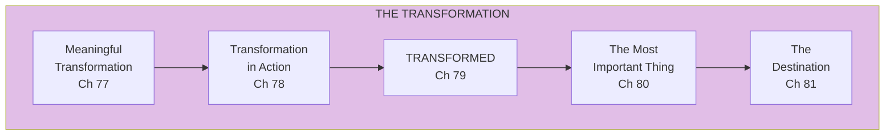
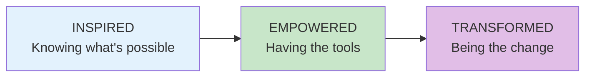

import { Aside } from '@astrojs/starlight/components';

# Part X: Inspired, Empowered, and Transformed

**Chapters 77-81** | The destination

<Aside type="tip" title="Simply Explained">
**In one sentence:** The journey goes: learn what's possible (Inspired) → get the tools and skills (Empowered) → become someone who helps others transform (Transformed).

**Imagine this:** Learning to ride a bike. First you're INSPIRED—you see other kids riding and think "I want to do that!" Then you get EMPOWERED—training wheels, practice, someone teaching you. Finally, you're TRANSFORMED—you ride naturally and now you help teach your little sister.

The destination isn't a finish line. It's a way of being—always learning, always helping others grow, always getting better together.

**Remember:** The most important thing is developing people. Everything else follows from that.
</Aside>

## Part Overview

Part X brings everything together, discussing meaningful transformation and the ultimate destination of truly empowered product teams.

## The Journey

## Chapters in This Part

| Chapter | Title | Key Concept |
|---------|-------|-------------|
| [The Journey](/chapters/part-10-transformation/journey/) | Complete Story | Full transformation |

## Related Concepts

- [Transformation](/concepts/transformation/)
