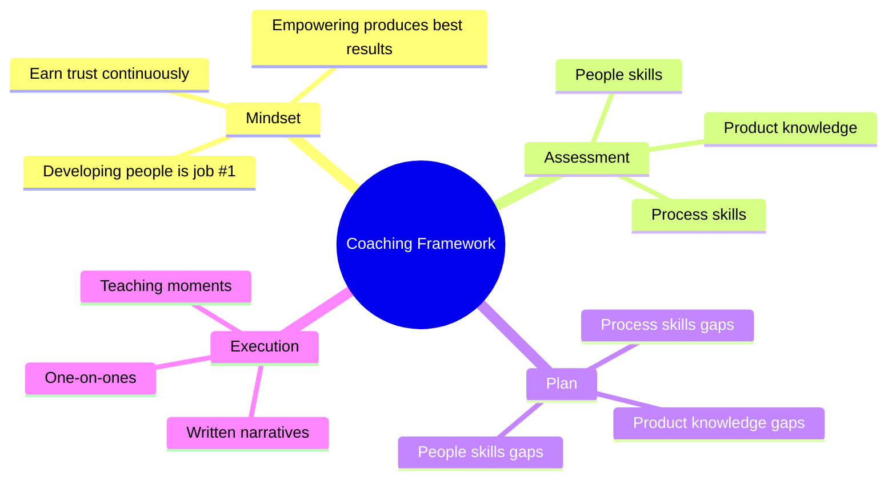
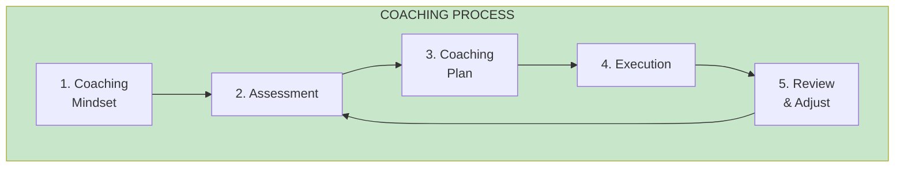
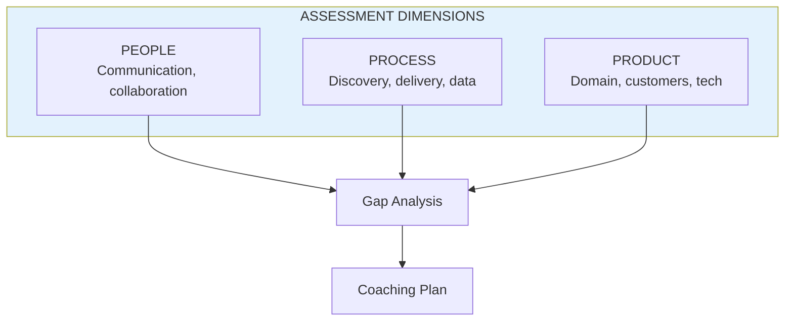

# Coaching Framework

## Concept Overview

The coaching framework in EMPOWERED provides a structured approach to developing people—the most important responsibility of a product leader.

## The Coaching Process

## The Assessment Framework

## Seven Principles of Coaching Mindset

1. **Developing people is job #1**
2. **Empowering people produces best results**
3. **Beware your own insecurities**
4. **Cultivate diverse points of view**
5. **Seek out teaching moments**
6. **Continually earn trust**
7. **Have courage to correct mistakes**

## Where This Appears

| Part | Chapter | Context |
|------|---------|---------|
| II | [Ch 7](/chapters/part-02-coaching/ch07-coaching-mindset/) | Foundation |
| II | [Ch 8-9](/chapters/part-02-coaching/ch08-assessment/) | Assessment & Plan |
| II | [Ch 10](/chapters/part-02-coaching/ch10-one-on-one/) | Execution |

## Related Concepts

- [Leadership](/concepts/leadership/) — Coaching is a leadership responsibility
- [Empowered Teams](/concepts/empowered-teams/) — Coaching enables empowerment
