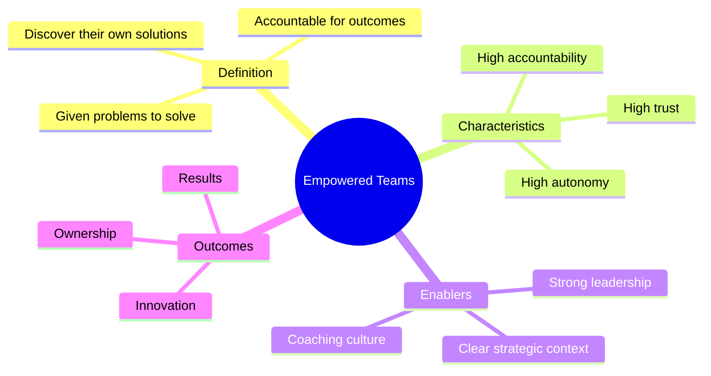
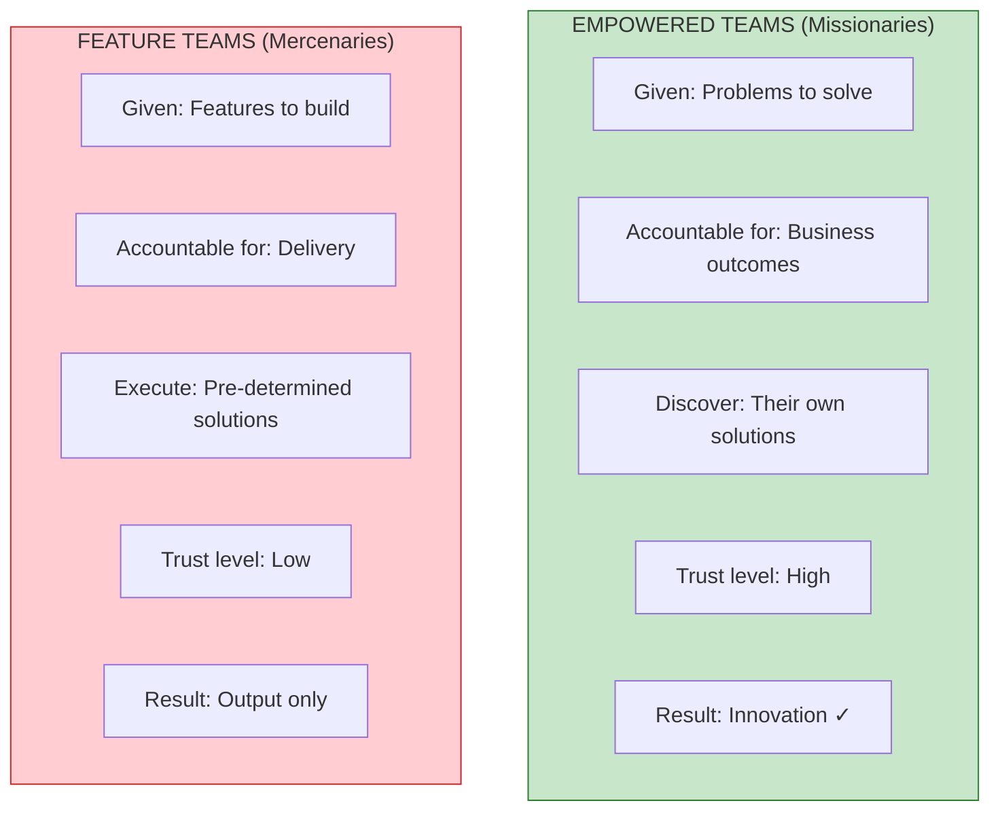
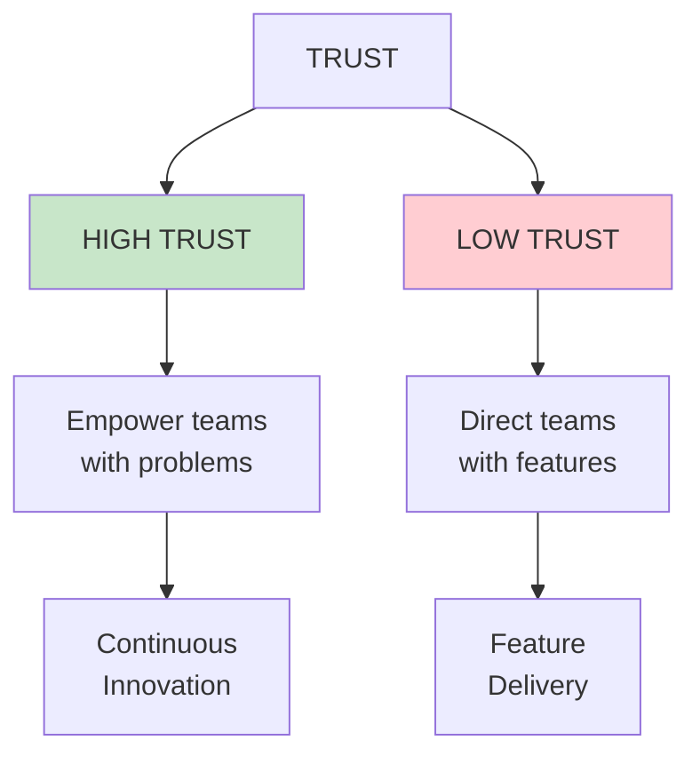

# Empowered Teams

## Concept Overview

The central concept in EMPOWERED is the distinction between **empowered teams** (missionaries) and **feature teams** (mercenaries). This isn't just about autonomy—it's about purpose, accountability, and trust.

## Empowered vs Feature Teams

## The Trust Gap

## Where This Appears

| Part | Chapter | Context |
|------|---------|---------|
| I | [Ch 4](/chapters/part-01-lessons/ch04-empowered-teams/) | Core definition |
| II | [Ch 13](/chapters/part-02-coaching/ch13-ownership/) | Ownership mindset |
| VII | [Ch 53](/chapters/part-07-objectives/ch53-empowerment/) | Empowerment through objectives |

## Related Concepts

- [Coaching Framework](/concepts/coaching-framework/) — How to develop empowered team members
- [The Product Model](/concepts/product-model/) — How empowered teams work
- [Leadership](/concepts/leadership/) — How leaders enable empowerment
