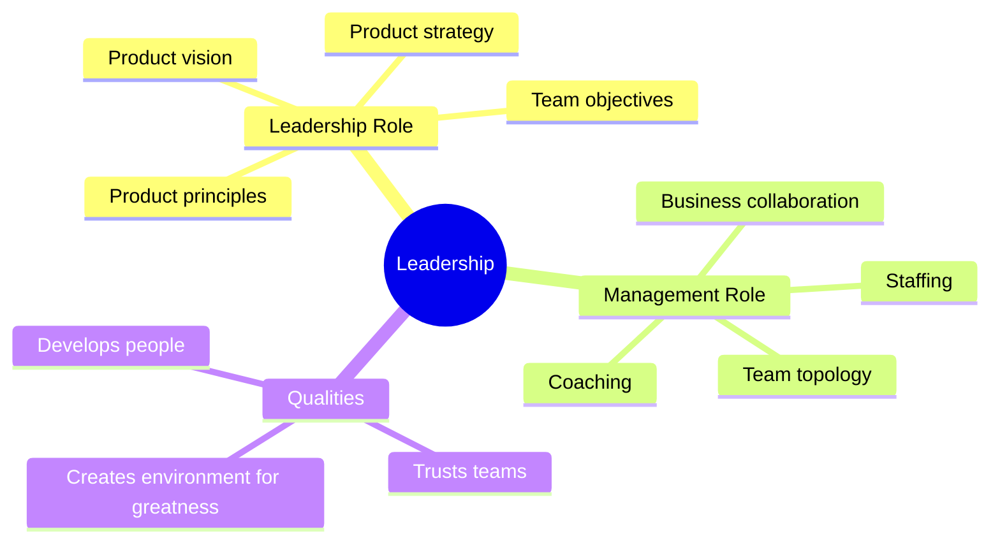
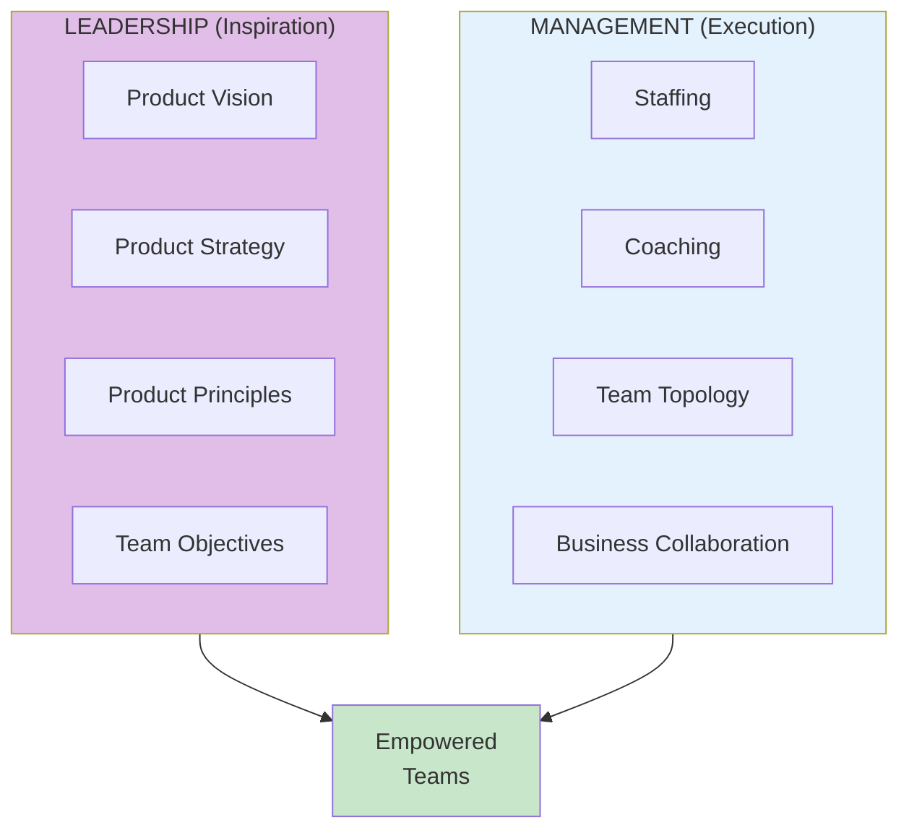

# Leadership

## Concept Overview

Leadership in the EMPOWERED context has two components: **leadership** (inspiration) and **management** (execution). Both are essential.

## Leadership vs Management

## Bill Campbell's Wisdom

> "Leadership is about recognizing that there's a greatness in everyone, and your job is to create an environment where that greatness can emerge."

## Where This Appears

| Part | Chapters | Context |
|------|----------|---------|
| I | [Ch 3](/chapters/part-01-lessons/ch03-strong-leadership/) | Foundation |
| II | Coaching | Management role |
| III | Staffing | Management role |
| IV-VI | Vision, Topology, Strategy | Leadership role |

## Related Concepts

- [Coaching Framework](/concepts/coaching-framework/)
- [Empowered Teams](/concepts/empowered-teams/)
- [Transformation](/concepts/transformation/)
