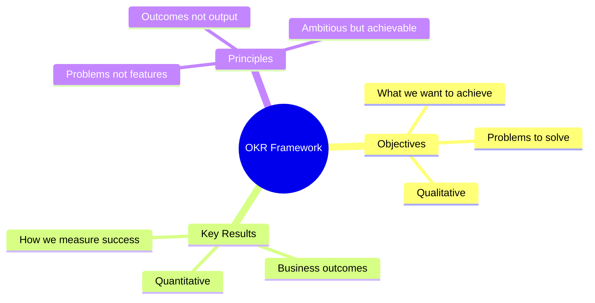
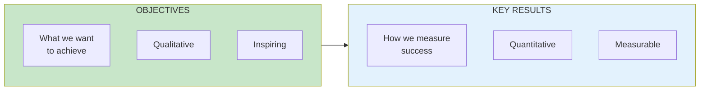
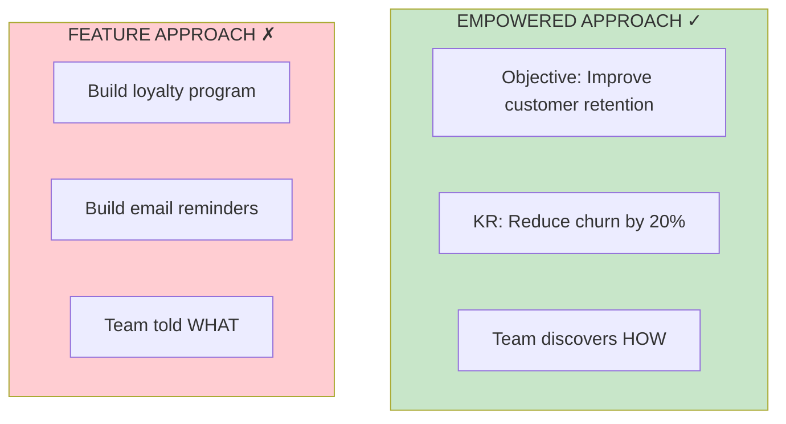

# OKR Framework

## Concept Overview

OKRs (Objectives and Key Results) are the mechanism for giving empowered teams problems to solve rather than features to build.

## The OKR Barbell

## Empowerment Through OKRs

## Where This Appears

| Part | Chapters | Context |
|------|----------|---------|
| VII | [Ch 53-61](/chapters/part-07-objectives/overview/) | Full coverage |
| VIII | Case Study | Applied example |

## Related Concepts

- [Empowered Teams](/concepts/empowered-teams/)
- [The Product Model](/concepts/product-model/)
