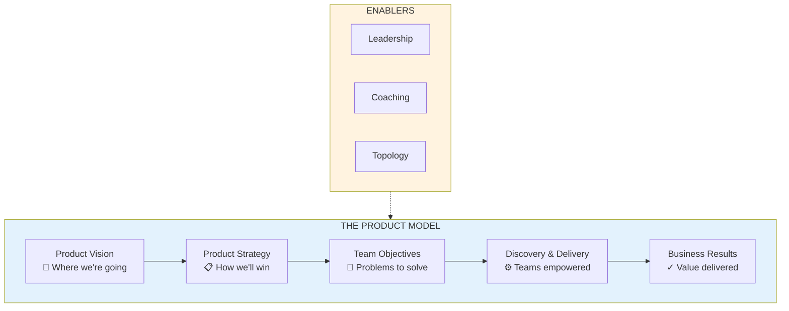
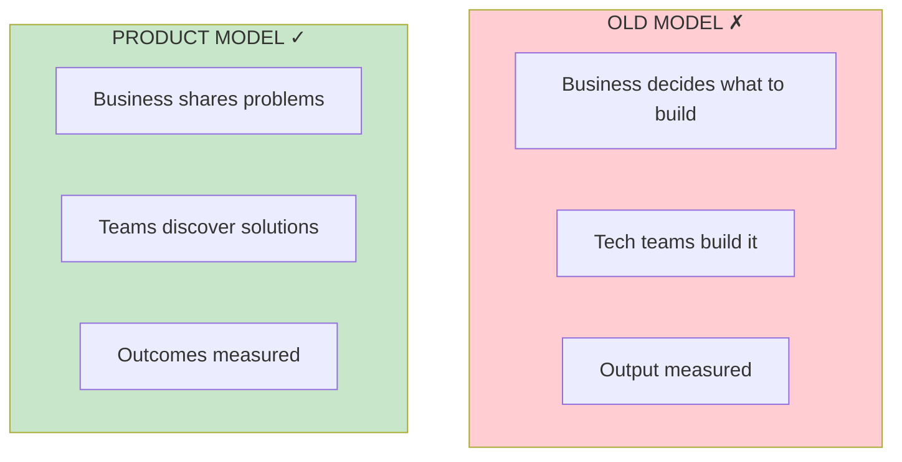

# The Product Model

## Concept Overview

The Product Model is how strong product companies work—with technology as a core enabler and empowered teams solving problems.

## Old Model vs Product Model

## Key Components

| Component | Description | Responsibility |
|-----------|-------------|----------------|
| **Vision** | Where we're going (3-10 years) | Product leadership |
| **Strategy** | How we'll get there | Product leadership |
| **Objectives** | Problems to solve | Leadership + Teams |
| **Discovery** | Finding solutions | Empowered teams |
| **Delivery** | Building solutions | Empowered teams |

## Where This Appears

| Part | Chapters | Context |
|------|----------|---------|
| I | [Overview](/chapters/part-01-lessons/overview/) | Foundation |
| IV-VI | Vision, Topology, Strategy | Components |
| VII | [Objectives](/chapters/part-07-objectives/overview/) | Team activation |

## Related Concepts

- [Product Vision](/concepts/product-vision/)
- [Team Topology](/concepts/team-topology/)
- [OKR Framework](/concepts/okr-framework/)
