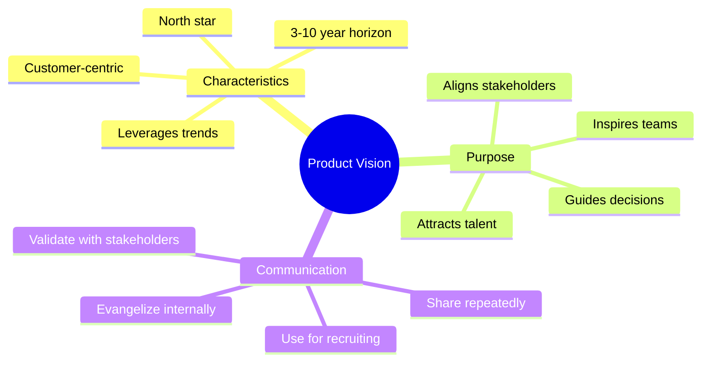
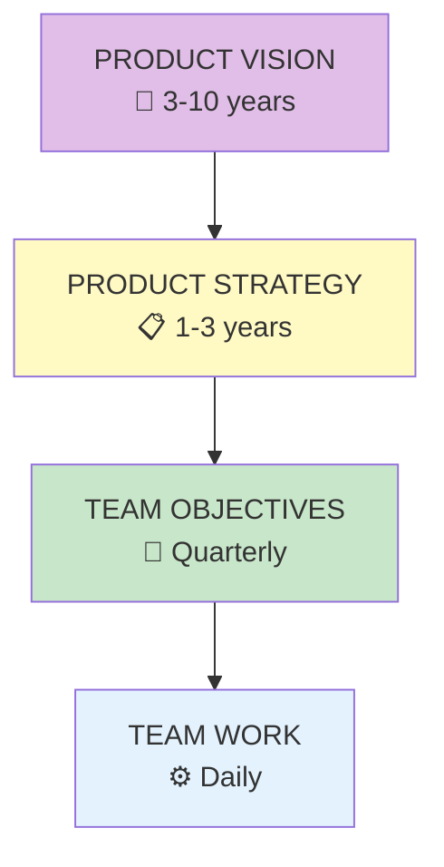

# Product Vision

## Concept Overview

Product vision is the north star that guides empowered teams—a compelling picture of the future that inspires and directs.

## Vision Cascade

## Vision Characteristics

| Characteristic | Description |
|---------------|-------------|
| **Customer-Centric** | Focused on customer value, not company or technology |
| **North Star** | Guides decisions, provides direction |
| **Achievable** | Ambitious but credible (3-10 year horizon) |
| **Trend-Aware** | Leverages technology and market trends |

## Where This Appears

| Part | Chapters | Context |
|------|----------|---------|
| IV | [Ch 37-40](/chapters/part-04-vision/overview/) | Full coverage |
| VIII | Case Study | Applied example |

## Related Concepts

- [The Product Model](/concepts/product-model/)
- [Leadership](/concepts/leadership/)
