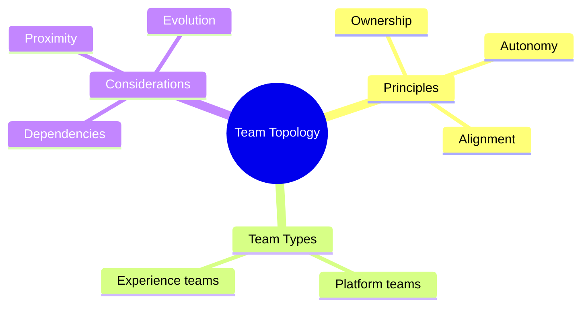
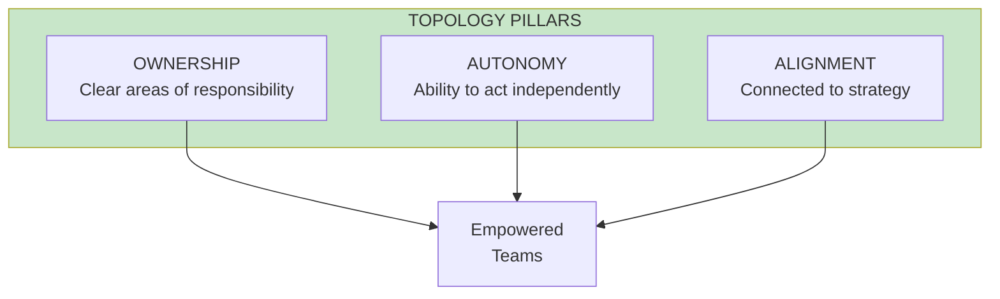
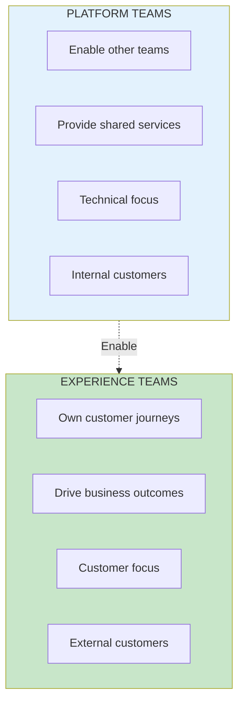

# Team Topology

## Concept Overview

Team topology is about structuring product teams for ownership, autonomy, and alignment.

## The Three Pillars

## Platform vs Experience Teams

## Where This Appears

| Part | Chapters | Context |
|------|----------|---------|
| V | [Ch 41-47](/chapters/part-05-topology/overview/) | Full coverage |
| VIII | Case Study | Applied example |

## Related Concepts

- [Empowered Teams](/concepts/empowered-teams/)
- [The Product Model](/concepts/product-model/)
