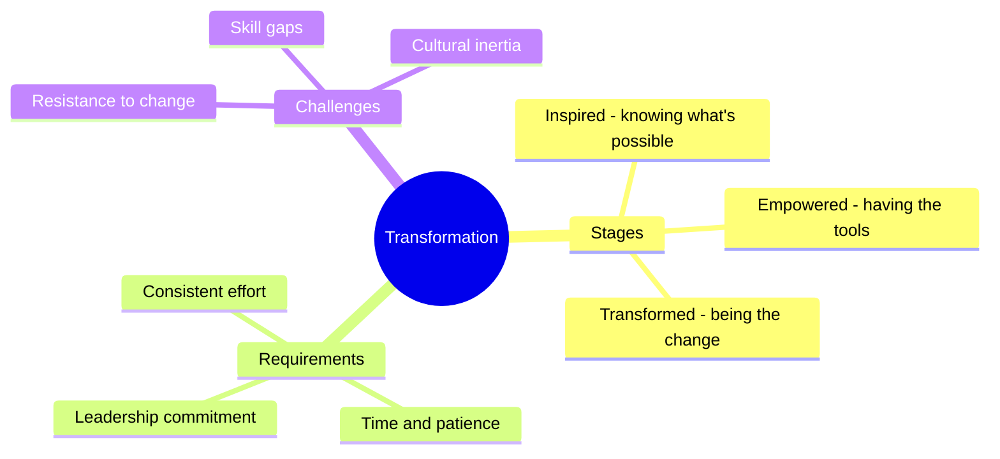
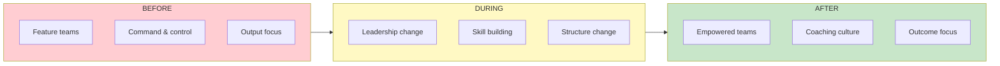
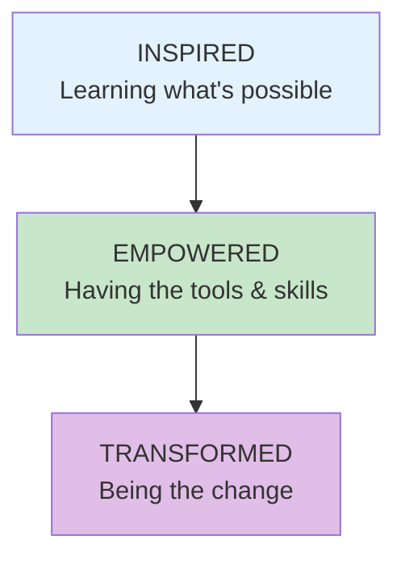

# Transformation

## Concept Overview

Transformation is the journey from a traditional, feature-team organization to one with truly empowered product teams.

## The Transformation Journey

## The Three Stages

## Where This Appears

| Part | Chapters | Context |
|------|----------|---------|
| VIII | [Case Study](/chapters/part-08-casestudy/overview/) | Applied example |
| X | [Ch 77-81](/chapters/part-10-transformation/overview/) | Full coverage |

## Related Concepts

- [Empowered Teams](/concepts/empowered-teams/)
- [Leadership](/concepts/leadership/)
