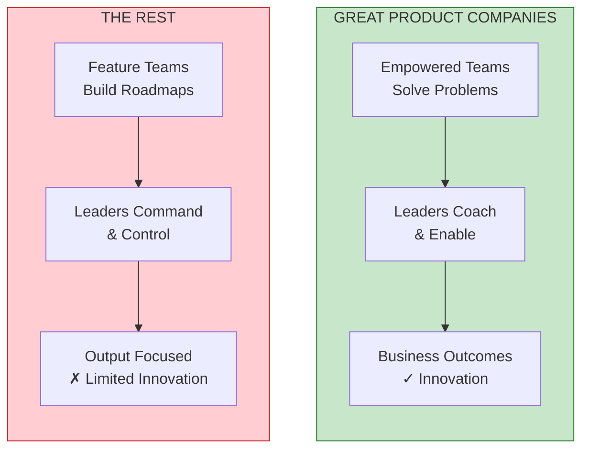
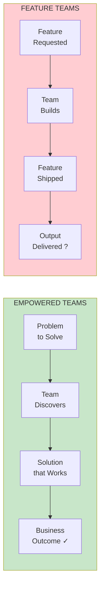
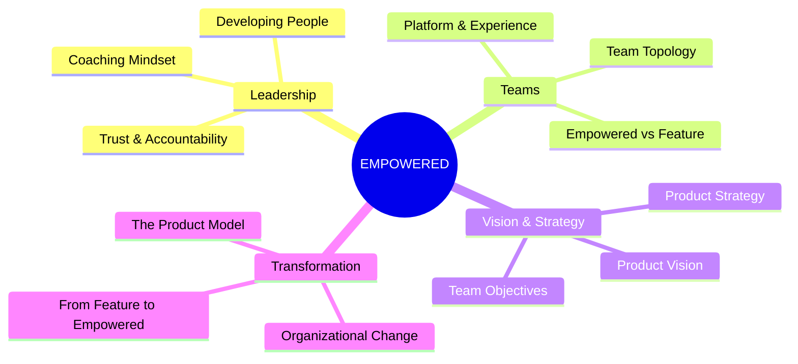
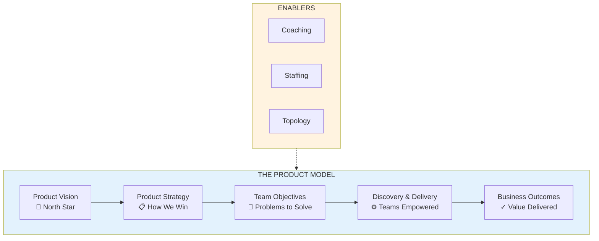

import { Card, CardGrid } from '@astrojs/starlight/components';

# EMPOWERED: Ordinary People, Extraordinary Products

**By Marty Cagan & Chris Jones** | Silicon Valley Product Group

## The Central Thesis

The difference between the best product companies and the rest isn't about having better people—it's about creating an environment where ordinary people can do extraordinary things. This requires **empowered product teams** rather than feature teams, and **strong product leadership** that coaches rather than commands.

> "Leadership is about recognizing that there's a greatness in everyone, and your job is to create an environment where that greatness can emerge."
> <cite>— Bill Campbell</cite>

---

## Empowered Teams vs Feature Teams

The core distinction in EMPOWERED is between two fundamentally different types of product teams:

| Aspect | Empowered Teams (Missionaries) | Feature Teams (Mercenaries) |
|--------|-------------------------------|----------------------------|
| **Given** | Problems to solve | Features to build |
| **Accountability** | Business outcomes | Delivery of output |
| **Decision Authority** | Discover their own solutions | Follow roadmaps |
| **Leadership Style** | Coached and enabled | Commanded and controlled |
| **Trust Level** | High trust, high accountability | Low trust, low autonomy |

---

## Book Structure

<CardGrid>
  <Card title="Part I: Lessons from Top Tech" icon="rocket">
    **Chapters 1-6**: What separates great product companies

    [Start Part I →](/chapters/part-01-lessons/overview/)
  </Card>
  <Card title="Part II: Coaching" icon="seti:todo">
    **Chapters 7-25**: The coaching mindset and techniques

    [Start Part II →](/chapters/part-02-coaching/overview/)
  </Card>
  <Card title="Part III: Staffing" icon="seti:folder-icon-awesome">
    **Chapters 26-36**: Competence, character, and hiring

    [Start Part III →](/chapters/part-03-staffing/overview/)
  </Card>
  <Card title="Part IV: Product Vision" icon="star">
    **Chapters 37-40**: Creating compelling vision

    [Start Part IV →](/chapters/part-04-vision/overview/)
  </Card>
  <Card title="Part V: Team Topology" icon="seti:folder-config">
    **Chapters 41-47**: Platform and experience teams

    [Start Part V →](/chapters/part-05-topology/overview/)
  </Card>
  <Card title="Part VI: Product Strategy" icon="open-book">
    **Chapters 48-52**: Focus, insights, and actions

    [Start Part VI →](/chapters/part-06-strategy/overview/)
  </Card>
  <Card title="Part VII: Team Objectives" icon="list-format">
    **Chapters 53-61**: OKRs and empowerment

    [Start Part VII →](/chapters/part-07-objectives/overview/)
  </Card>
  <Card title="Part VIII: Case Study" icon="document">
    **Chapters 62-70**: Transformation in practice

    [Start Part VIII →](/chapters/part-08-casestudy/overview/)
  </Card>
  <Card title="Part IX: Business Collaboration" icon="seti:salesforce">
    **Chapters 71-76**: Stakeholder management

    [Start Part IX →](/chapters/part-09-collaboration/overview/)
  </Card>
  <Card title="Part X: Transformation" icon="approve-check-circle">
    **Chapters 77-81**: The journey complete

    [Start Part X →](/chapters/part-10-transformation/overview/)
  </Card>
</CardGrid>

---

## Core Concepts Map

---

## The Product Model

Strong product companies operate using what SVPG calls "The Product Model"—a way of working where technology is central to the business and teams are empowered to solve problems:

---

## Key Comparisons

| Aspect | Old Way | The Product Model |
|--------|---------|-------------------|
| **Technology Role** | Cost center, serve the business | Core business enabler |
| **Team Purpose** | Build what's requested | Solve customer problems |
| **Manager Role** | Allocate work, track progress | Coach, remove obstacles |
| **Success Metric** | Features shipped | Business outcomes |
| **Innovation** | Rare, top-down | Continuous, team-driven |

---

## About This Companion

This visual learning companion transforms EMPOWERED into digestible visual representations using:

- **Mermaid Diagrams**: Flowcharts, mindmaps, and concept maps
- **viz-business Patterns**: 2x2 matrices, decision trees, value chains
- **Progressive Learning**: Three guided paths from foundational to advanced
- **Cross-References**: Concepts linked across all chapters

**Start your journey:**
- [Product Leader Path](/paths/product-leader/) — Beginner
- [Team Builder Path](/paths/team-builder/) — Intermediate
- [Transformer Path](/paths/transformer/) — Advanced
