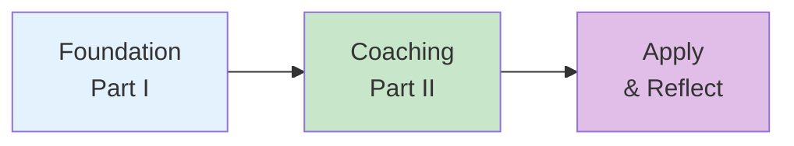
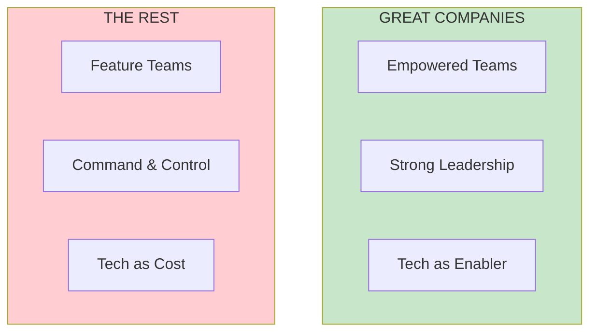
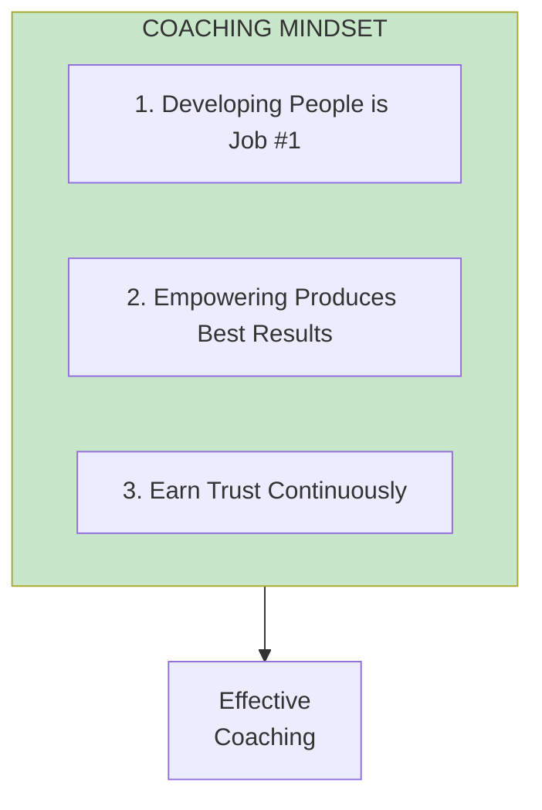

# Learning Path: Product Leader

**Level: Beginner** | **Parts I-II** | **25 Chapters**

This path covers the foundational concepts of product leadership—understanding the difference between empowered and feature teams, and the coaching mindset needed to develop people.

## Path Overview

---

## Step 1: The Foundation

**Goal:** Understand what separates great product companies from the rest

### Read
- [Part I Overview](/chapters/part-01-lessons/overview/)
- [Chapter 1: Behind Every Great Company](/chapters/part-01-lessons/ch01-behind-great-company/)
- [Chapter 4: Empowered Product Teams](/chapters/part-01-lessons/ch04-empowered-teams/)

### Key Diagram

### Check Your Understanding
- [ ] Can you explain the difference between empowered and feature teams?
- [ ] Do you understand why trust is the key barrier to empowerment?
- [ ] Can you articulate the Bill Campbell quote about leadership?

### Related Concepts
- [Empowered Teams](/concepts/empowered-teams/) — The fundamental distinction between missionaries and mercenaries
- [Leadership](/concepts/leadership/) — How leaders create environments where greatness can emerge

### Go Deeper (Optional)
Want to explore more? These additional chapters expand on the foundation:
- [Chapter 2: The Role of Technology](/chapters/part-01-lessons/ch02-role-of-technology/) — Why technology must be an enabler, not a cost center
- [Chapter 3: Strong Product Leadership](/chapters/part-01-lessons/ch03-strong-leadership/) — The dual role of inspiration and execution
- [Chapter 5: Leadership in Action](/chapters/part-01-lessons/ch05-leadership-action/) — How great leaders actually spend their time

---

## Step 2: The Coaching Mindset

**Goal:** Develop the mindset needed to coach and develop people

### Read
- [Part II Overview](/chapters/part-02-coaching/overview/)
- [Chapter 7: The Coaching Mindset](/chapters/part-02-coaching/ch07-coaching-mindset/)
- [Chapter 10: The One-on-One](/chapters/part-02-coaching/ch10-one-on-one/)

### Key Diagram

### Check Your Understanding
- [ ] Can you list the seven principles of the coaching mindset?
- [ ] Do you understand how to run effective one-on-ones?
- [ ] Can you identify coaching anti-patterns in your own practice?

### Related Concepts
- [Coaching Framework](/concepts/coaching-framework/) — The structured approach to developing people
- [Leadership](/concepts/leadership/) — Coaching as a core leadership responsibility

### Go Deeper (Optional)
Ready for more coaching techniques? Explore these chapters:
- [Chapter 8: The Assessment](/chapters/part-02-coaching/ch08-assessment/) — How to evaluate where someone is before you can help them grow
- [Chapter 9: The Coaching Plan](/chapters/part-02-coaching/ch09-coaching-plan/) — Creating structured development roadmaps
- [Chapter 11: The Written Narrative](/chapters/part-02-coaching/ch11-written-narrative/) — Using writing to force clarity in coaching conversations

---

## Step 3: Apply & Reflect

**Goal:** Apply what you've learned and prepare for the next level

### Actions
1. Assess your current team—are they empowered or feature teams?
2. Evaluate your one-on-ones against the principles
3. Identify one person to invest more coaching time in

### Reflection Questions
- What would need to change to move toward empowered teams?
- Where are you spending your time as a leader?
- What coaching opportunities have you been missing?

### Related Concepts
- [Empowered Teams](/concepts/empowered-teams/) — Apply the empowered vs feature team assessment
- [Coaching Framework](/concepts/coaching-framework/) — Use the assessment dimensions for your coaching plan

### Go Deeper (Optional)
As you apply what you've learned, these chapters offer additional context:
- [Chapter 6: A Guide to EMPOWERED](/chapters/part-01-lessons/ch06-guide-empowered/) — How to navigate the rest of the book based on your role
- [Chapter 12: Strategic Context](/chapters/part-02-coaching/ch12-strategic-context/) — Ensuring your team understands the bigger picture
- [Chapter 13: Ownership](/chapters/part-02-coaching/ch13-ownership/) — Building true ownership in empowered teams

---

## Path Complete!

Congratulations! You've built a solid foundation in product leadership. Here's what you've mastered:

### Concepts Mastered

| Concept | What You Learned |
|---------|------------------|
| [Empowered Teams](/concepts/empowered-teams/) | The fundamental difference between empowered and feature teams, and why trust is the key barrier to empowerment |
| [Leadership](/concepts/leadership/) | How great leaders inspire through vision while earning trust through competence |
| [Coaching Framework](/concepts/coaching-framework/) | The seven principles of the coaching mindset and how to run effective one-on-ones |

### Key Takeaways
- **Empowerment requires trust** — You can't simply declare teams empowered; trust must be earned through demonstrated competence
- **Coaching is job #1** — Developing people is the primary responsibility of a product leader
- **One-on-ones matter** — Regular, structured conversations are the foundation of effective coaching

### What's Next?

**Continue with:** [Team Builder Path](/paths/team-builder/) to learn about staffing, topology, and strategy.

Or revisit any concept to deepen your understanding:
- [Empowered Teams](/concepts/empowered-teams/) — Review the empowered vs feature team distinction
- [Leadership](/concepts/leadership/) — Explore leadership patterns in more depth
- [Coaching Framework](/concepts/coaching-framework/) — Dive deeper into assessment and coaching plans
